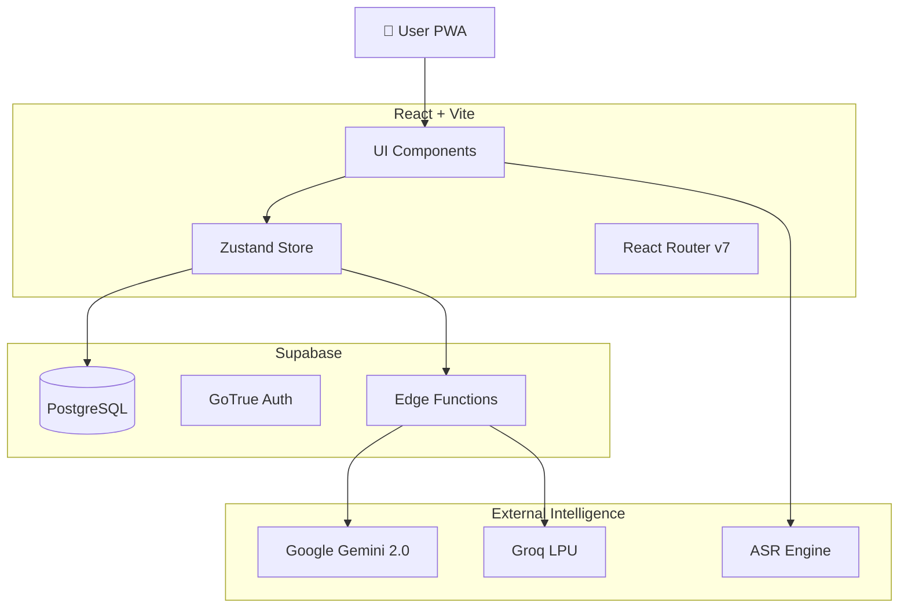

# 🏗️ System Architecture: QuranPulse v6.0

## High-Level Overview

QuranPulse v6.0 follows a **"Supabase-First" Modular Monolith** architecture. The frontend is a thick client (PWA) that communicates directly with Supabase for data and Edge Functions for compute-heavy tasks (AI).

## Core Modules

### 1. Client-Side (The "Body")
* **Framework:** React 18 with Vite for lightning-fast HMR.
* **State Management:** `zustand` for global state (User, Theme, Player).
* **Styling:** `index.css` with CSS Variables for themes (`data-theme="nabdh"`).

### 2. Server-Side (The "Brain")
* **Database:** PostgreSQL with Row Level Security (RLS). Direct access from client via `@supabase/supabase-js`.
* **Edge Functions:** TypeScript/Deno functions in `supabase/functions`.
  * `chat-proxy`: Handles AI requests, key rotation, and context window management.
  * `verify-payment`: Secure webhook for payment gateways.

### 3. AI Pipeline (The "Soul")
* **Text Generation:** Hybrid failover strategy.
  * Primary: **Groq (Llama 3)** for speed (<300ms latency).
  * Complex/Reasoning: **Gemini 2.0 Flash** for depth.
* **Speech Recognition (ASR):**
  * CURRENT: Browser `SpeechRecognition` API (Pollyfill).
  * TARGET: Server-side Whisper pipeline via FastAPI (Prototype exists in `prototypes/asr_engine`).

## Data Flow
1. **Read:** Client fetches JSON data (Surahs/Hadith) from `src/data` (static) or Supabase (dynamic user data).
2. **Write:** Client writes to Supabase Tables (`bookmarks`, `journal`).
3. **Compute:** Client invokes `supabase.functions.invoke('chat-proxy')` -> Edge Function calls LLM -> Streams response back.

## Security
* **RLS:** All tables provided `Enable RLS`. Users can only select/insert their own rows.
* **Env Vars:** API Keys stored in Supabase Vault not exposed to client.

## Future Scalability
* **Microservices:** The ASR Engine is designed to be peeled off into a separate Python/FastAPI container service.
* **PWA:** Service Workers cache `quran-data` for offline reading.
