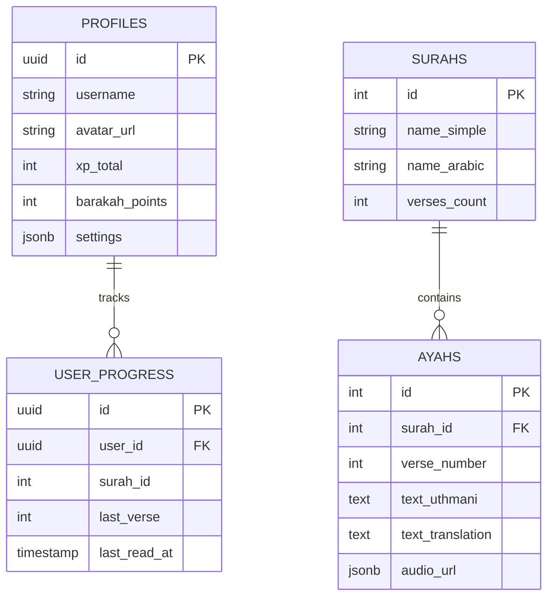

# 🏛️ QuranPulse v6.0 System Architecture

## 1. High-Level Overview

QuranPulse v6.0 is a **Progressive Web Application (PWA)** built on a modern serverless architecture. It leverages **React** for the frontend, **Supabase** for the backend (Database & Auth), and a custom **AI Service Layer** for intelligence features.

```mermaid
graph TD
    User[User Device] -->|HTTPS| CDN[Vercel Edge Network]
    CDN -->|Serves| Client[React Client App]
    
    subgraph "Frontend Layer (Client)"
        Client -->|Routing| Router[React Router]
        Router -->|Render| Modules[Modules: Quran, Iqra, SmartDeen]
        Modules -->|State| Query[TanStack Query]
        Modules -->|UI| Components[UI Components]
        Components -->|Theme| ThemeEngine[Pulse Control Center]
    end
    
    subgraph "Service Layer"
        Query -->|Fetch| SupabaseClient[Supabase JS Client]
        Query -->|Fetch| AIService[AI Service (GLM-4)]
        Query -->|Fetch| TTSService[Text-to-Speech]
    end
    
    subgraph "Backend Layer (Serverless)"
        SupabaseClient -->|Auth| Auth[Supabase Auth]
        SupabaseClient -->|Data| DB[(PostgreSQL Database)]
        SupabaseClient -->|Storage| Storage[Supabase Storage]
    end
```

---

## 2. Frontend Architecture

The frontend is built with **Vite + React + TypeScript**. It emphasizes performance, modularity, and a premium "Game-like" UI experience.

### 2.1 Core Technologies
-   **Framework:** React 18
-   **Build Tool:** Vite (Fast HMR & Bundling)
-   **Styling:** Tailwind CSS v4 + Framer Motion (Animations)
-   **State Management:**
    -   **Server State:** `@tanstack/react-query` (Caching, Synchronization)
    -   **Global UI State:** React Context API (`AudioPlayerContext`, `GamificationContext`)
    -   **Local State:** `useState`, `useReducer`

### 2.2 Module Structure
The application is divided into feature-based modules to ensure separation of concerns:

| Module | Description | Key Components |
| :--- | :--- | :--- |
| **Quran** | Core reading experience | `QuranReader`, `VerseStudio`, `AudioPlayer` |
| **Iqra** | Learning & Education | `VisionCoach` (AR), `SmartMode`, `Analytics` |
| **Smart Deen** | Daily Islamic utilities | `PrayerTimes`, `QiblaCompass`, `UstazAI` |
| **Social** | Community features | `Leaderboard`, `Badges`, `Feed` |
| **Admin** | Management dashboard | `UserManagement`, `ContentCMS` |

### 2.3 Theme System (Pulse Engine)
The application features a dynamic theme switching engine controlled by `PulseControlCenter.tsx`.
-   **Deep Space (Default):** Dark mode, gold accents, starfield backgrounds.
-   **Cyber Pulse (v6.0):** Navy/Cyan palette, circuit board patterns, HUD interfaces.
-   **Implementation:** Uses CSS variables and body classes (`.cyber-mode`) to override Tailwind utility classes globally.

---

## 3. Backend Architecture (Supabase)

We use Supabase as a Backend-as-a-Service (BaaS) to handle data persistence, authentication, and realtime subscriptions.

### 3.1 Database Schema (PostgreSQL)



### 3.2 Security
-   **Row Level Security (RLS):** Enabled on all tables.
    -   `profiles`: Users can only read/update their own profile.
    -   `surahs`/`ayahs`: Public read access.
-   **Authentication:** Supabase Auth (Email/Password, Social Providers).

---

## 4. AI Service Layer

The intelligence of QuranPulse is powered by the `aiService.ts` module.

### 4.1 Capabilities
-   **Semantic Search:** Vector-like search simulation for finding verses by meaning.
-   **Generative Tafsir:** On-demand explanation of verses using LLM prompts.
-   **Morphology Analysis:** Grammatical breakdown of Arabic words.
-   **Conversational AI:** "Ustaz AI" chatbot for religious queries.

### 4.2 Integration Strategy
Currently, the system uses a **Hybrid Mock/Real approach**:
1.  **Development:** Realistic mocks with simulated latency (`setTimeout`) to mimic API calls without cost.
2.  **Production:** Designed to swap mocks with actual API calls to **Zhipu AI (GLM-4)** or OpenAI via Edge Functions.

---

## 5. Data Flow & State Management

We utilize **TanStack Query** to manage server state, eliminating the need for complex Redux boilerplate for data fetching.

1.  **Component Mounts:** e.g., `QuranReader` requests Surah data.
2.  **Query Hook:** `useQuery(['surah', id])` checks cache.
3.  **Cache Miss:** Fetches data from Supabase via `quranService`.
4.  **Data Arrival:** UI updates automatically.
5.  **Mutations:** User actions (e.g., "Mark as Read") trigger `useMutation`, which optimistically updates the UI and syncs with Supabase in the background.

---

## 6. Deployment Pipeline

The project follows a **GitOps** workflow with Vercel.

1.  **Code Push:** Developer pushes to `master` branch on GitHub.
2.  **CI/CD:** Vercel detects the commit.
3.  **Build:** Runs `npm run build` (Vite build).
4.  **Deploy:** Static assets are distributed to the Vercel Edge Network.
5.  **Live:** Changes are instantly available globally.

---

## 7. Directory Structure

```
/
├── src/
│   ├── assets/         # Static images, icons, audio
│   ├── components/     # Reusable UI components (Buttons, Cards)
│   ├── contexts/       # Global React Contexts (Audio, Game)
│   ├── hooks/          # Custom React Hooks
│   ├── modules/        # Feature-based Page Views (Quran, Iqra)
│   ├── services/       # API Clients (Supabase, AI, TTS)
│   ├── types/          # TypeScript Interfaces
│   ├── utils/          # Helper functions
│   ├── App.tsx         # Main Application Entry
│   └── main.tsx        # DOM Renderer
├── supabase/           # SQL Migrations & Schema
├── public/             # Public assets (manifest.json)
└── index.html          # Entry HTML
```
