# QuranPulse v6.0 Architecture Documentation

**Document Version:** 1.2  
**Last Updated:** 2025-11-28  
**Authors:** QuranPulse Engineering Team

---

## Table of Contents

1. [Executive Summary](#1-executive-summary)
2. [System Architecture](#2-system-architecture)
3. [Technology Stack](#3-technology-stack)
## 1. Executive Summary

### 1.1 Overview

QuranPulse v6.0 is a production-grade, full-stack Islamic lifestyle platform built using modern web technologies. The application follows a **microservices-inspired monolithic architecture** with clear service boundaries, designed for eventual decomposition into true microservices.

### 1.2 Architectural Principles

| Principle | Implementation |
|-----------|----------------|
| **Separation of Concerns** | Feature-based module structure with clear boundaries |
| **Scalability** | Horizontal scaling via containerization, vertical via resource optimization |
| **Maintainability** | TypeScript, ESLint, consistent code patterns, comprehensive tests |
| **Security-First** | JWT authentication, input validation, rate limiting, CORS policies |
| **Performance** | Code splitting, lazy loading, CDN integration, caching strategies |
| **Accessibility** | WCAG 2.1 AA compliance, semantic HTML, ARIA attributes |

### 1.3 System Capabilities

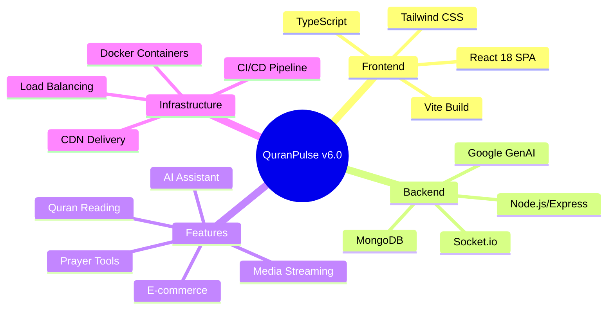

---

## 2. System Architecture

### 2.1 High-Level Architecture

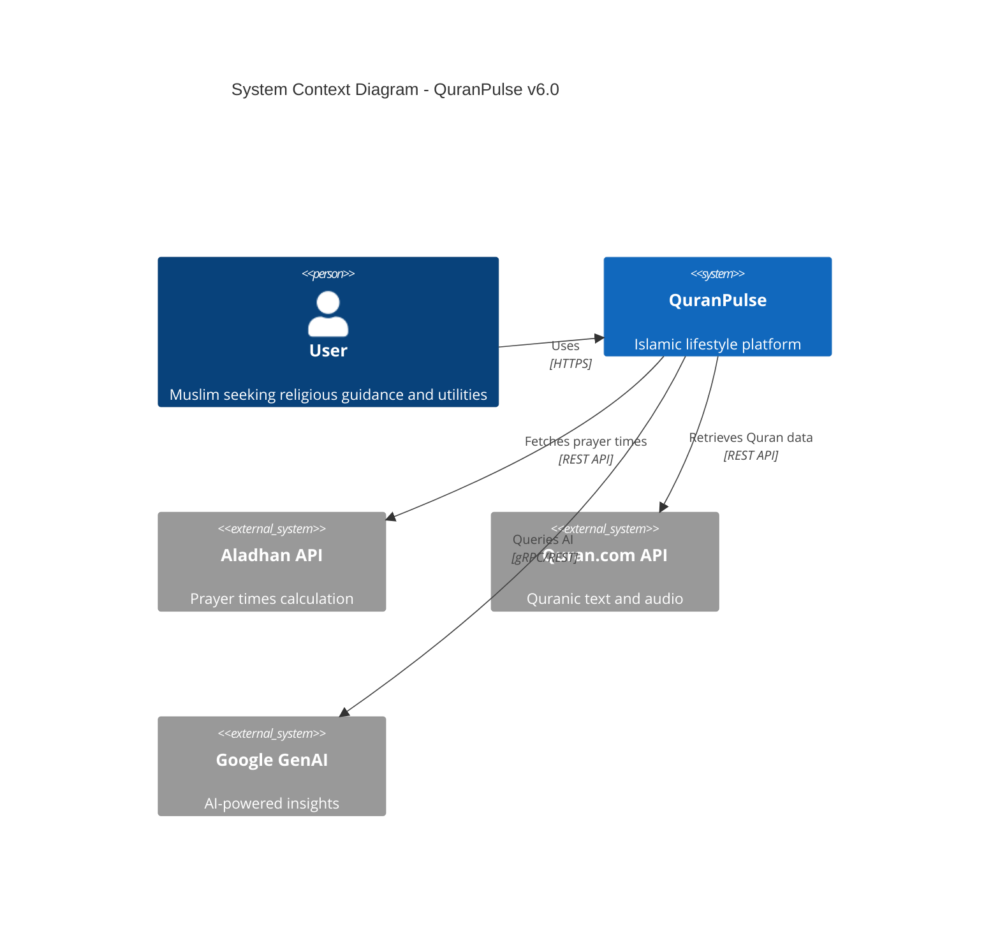

### 2.2 Component Architecture

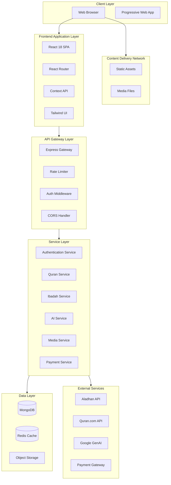

### 2.3 Module Architecture

Each module follows a consistent internal structure:

```text
Module/
├── index.tsx              # Main entry component
├── components/            # Module-specific components
│   ├── ModuleHeader.tsx
│   ├── ModuleContent.tsx
│   └── ModuleFooter.tsx
├── hooks/                 # Custom hooks
│   ├── useModuleData.ts
│   └── useModuleActions.ts
├── services/              # API integration
│   └── moduleService.ts
├── types/                 # TypeScript definitions
│   └── module.types.ts
├── utils/                 # Helper functions
│   └── moduleUtils.ts
├── styles/                # CSS Modules
│   └── Module.module.css
└── __tests__/             # Unit tests
    └── Module.test.tsx
```

---

## 3. Technology Stack

### 3.1 Frontend Stack

#### Core Technologies

| Technology | Version | Purpose | Rationale |
|------------|---------|---------|-----------|
| **React** | 18.2.0 | UI Framework | Industry standard, large ecosystem, excellent performance |
| **TypeScript** | ~5.8.2 | Type Safety | Catch errors at compile-time, better IDE support |
| **Vite** | 6.2.0 | Build Tool | Fast HMR, optimized builds, modern dev experience |
| **React Router** | 7.9.6 | Routing | Declarative routing, code splitting support |

#### Styling & UI

| Technology | Version | Purpose |
|------------|---------|---------|
| **Tailwind CSS** | 4.1.17 | Utility-first CSS framework |
| **PostCSS** | 8.5.6 | CSS processing pipeline |
| **Framer Motion** | 11.0.0 | Animation library |
| **CSS Modules** | - | Scoped styling for components |

#### State Management Strategy

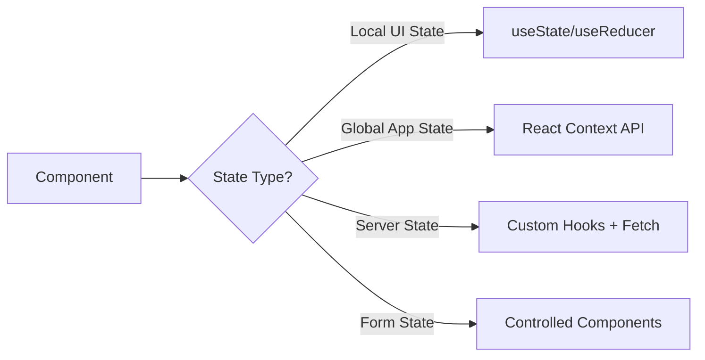

### 3.2 Backend Stack

#### Backend Core Technologies

| Technology | Version | Purpose |
|------------|---------|---------|
| **Node.js** | v18+ | Runtime environment |
| **Express** | 5.1.0 | Web framework |
| **MongoDB** | 8.0.3 | NoSQL database |
| **Mongoose** | 8.0.3 | ODM for MongoDB |
| **Socket.io** | 4.7.4 | Real-time communication |

#### Security & Authentication


## 4. Application Layers

### 4.1 Presentation Layer (Frontend)

#### Routing Architecture

```typescript
// App.tsx - Routing Structure
<Routes>
  {/* Public Routes */}
  <Route path="/" element={<LandingPage />} />
  <Route path="/auth" element={<Auth />} />
  
  {/* Protected Routes */}
  <Route element={<ProtectedRoute />}>
    <Route path="/dashboard" element={<Dashboard />} />
    <Route path="/quran" element={<Quran />} />
    <Route path="/ibadah" element={<Ibadah />} />
    {/* ... other protected routes */}
  </Route>
  
  {/* Admin Routes */}
  <Route element={<AdminRoute />}>
    <Route path="/admin" element={<Admin />} />
  </Route>
</Routes>
```

#### Component Hierarchy

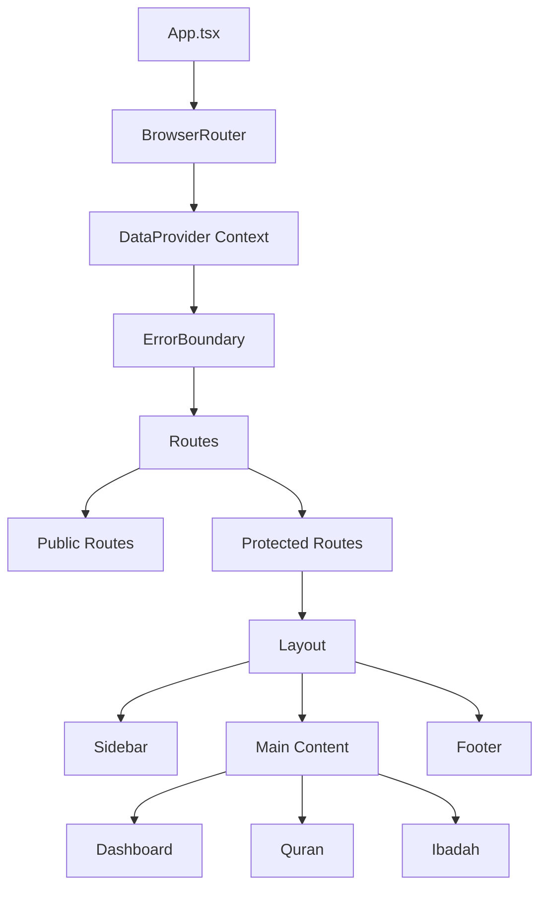

### 4.2 Business Logic Layer

#### Service Architecture

Each service handles a specific domain:

```typescript
// Example: prayerService.ts
export class PrayerService {
  private apiClient: AxiosInstance;
  private cache: Map<string, CacheEntry>;
  
  async getPrayerTimes(lat: number, lng: number): Promise<PrayerTimes> {
    const cacheKey = `${lat},${lng}`;
    if (this.cache.has(cacheKey)) {
      return this.cache.get(cacheKey)!.data;
    }
    
    const data = await this.apiClient.get('/timings', { params: { lat, lng }});
    this.cache.set(cacheKey, { data, expiry: Date.now() + 3600000 });
    return data;
  }
  
  calculateQiblaDirection(lat: number, lng: number): number {
    // Spherical trigonometry calculation
    const meccaLat = 21.4225;
    const meccaLng = 39.8262;
    // ... calculation logic
  }
}
```

### 4.3 Data Access Layer

#### Supabase Schema Design

The database schema is defined in `supabase_schema.sql` and uses PostgreSQL.

```sql
-- User Profile Table (extends auth.users)
CREATE TABLE public.profiles (
  id UUID REFERENCES auth.users(id) PRIMARY KEY,
  email TEXT,
  full_name TEXT,
  avatar_url TEXT,
  role TEXT DEFAULT 'USER',
  xp_total INTEGER DEFAULT 0,
  level INTEGER DEFAULT 1,
  barakah_points INTEGER DEFAULT 0,
  created_at TIMESTAMPTZ DEFAULT NOW()
);

-- Prayer Times Logs
CREATE TABLE public.prayer_logs (
  id UUID DEFAULT gen_random_uuid() PRIMARY KEY,
  user_id UUID REFERENCES public.profiles(id),
  prayer_name TEXT, -- fajr, dhuhr, etc.
  status TEXT, -- on_time, late, missed
  logged_at TIMESTAMPTZ DEFAULT NOW(),
  xp_awarded INTEGER
);
```

---

## 5. Data Architecture

### 5.1 Database Design

#### Entity-Relationship Diagram

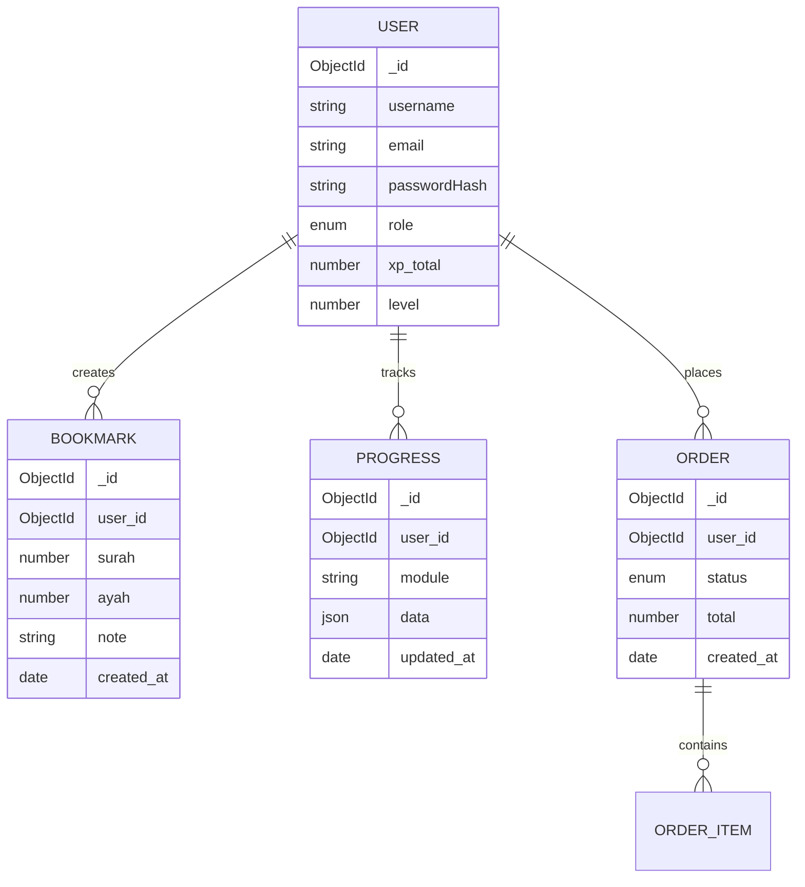

### 5.2 Caching Strategy

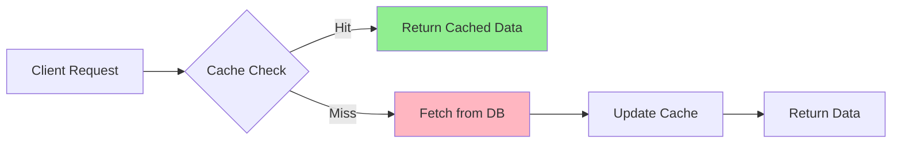

**Caching Layers:**

1. **Browser Cache** - Static assets (images, CSS, JS)
2. **Service Worker** - Offline-first for PWA
3. **Redis** - API responses, session data
4. **CDN** - Global content delivery

### 5.3 Data Flow Patterns

#### Read Pattern

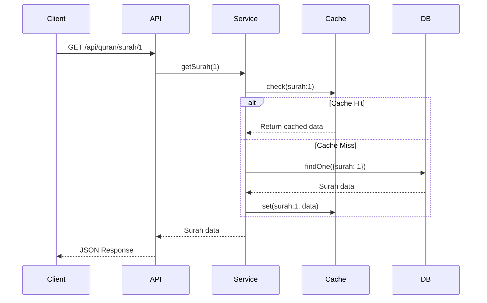

#### Write Pattern

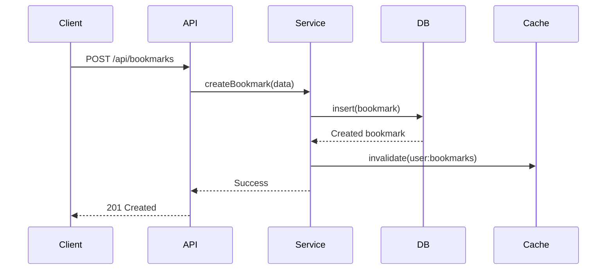

---

## 6. Security Architecture

### 6.1 Authentication Flow

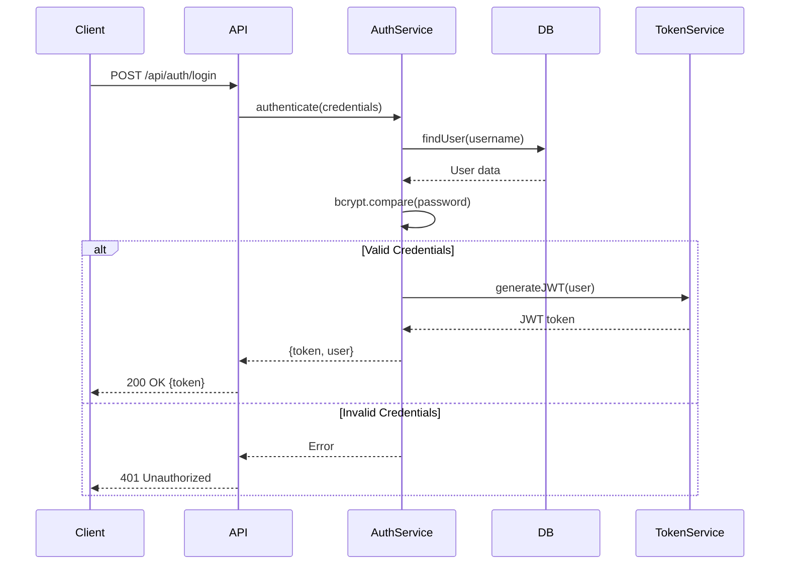

### 6.2 Authorization Strategy

```typescript
// Role-Based Access Control (RBAC)
enum Role {
  USER = 'USER',
  ADMIN = 'ADMIN',
  MODERATOR = 'MODERATOR'
}

const permissions = {
  USER: ['read:quran', 'write:bookmark', 'read:profile'],
  MODERATOR: ['read:quran', 'write:content', 'moderate:comments'],
  ADMIN: ['*'] // All permissions
};

// Middleware
const authorize = (requiredPermission: string) => {
  return (req, res, next) => {
    const userRole = req.user.role;
    const userPermissions = permissions[userRole];
    
    if (userPermissions.includes('*') || userPermissions.includes(requiredPermission)) {
      next();
    } else {
      res.status(403).json({ error: 'Forbidden' });
    }
  };
};
```

### 6.3 Security Measures

| Layer | Security Measure | Implementation |
|-------|------------------|----------------|
| **Transport** | HTTPS/TLS 1.3 | SSL certificates, HSTS headers |
| **Authentication** | JWT + Refresh Tokens | 15min access, 7day refresh |
| **Password** | Bcrypt hashing | Salt rounds: 10 |
| **API** | Rate limiting | 100 req/15min per IP |
| **Headers** | Helmet.js | CSP, XSS protection, etc. |
| **Input** | Validation & Sanitization | Joi schemas, DOMPurify |
| **Database** | Mongoose injection prevention | Parameterized queries |

---

## 7. API Design

### 7.1 RESTful API Structure

```http
Base URL: https://api.quranpulse.app/v1

Authentication:
  POST   /auth/register
  POST   /auth/login
  POST   /auth/refresh
  POST   /auth/logout

User Management:
  GET    /users/me
  PUT    /users/me
  GET    /users/:id/stats
  
Quran:
  GET    /quran/surahs
  GET    /quran/surahs/:id
  GET    /quran/ayahs/:surah/:ayah
  GET    /quran/search?q={query}
  
Bookmarks:
  GET    /bookmarks
  POST   /bookmarks
  DELETE /bookmarks/:id
  
Prayer Times:
  GET    /prayer-times?lat={lat}&lng={lng}
  GET    /qibla?lat={lat}&lng={lng}
  
AI Assistant:
  POST   /ai/chat
  POST   /ai/recommendations
  
Admin:
  GET    /admin/users
  GET    /admin/logs
  POST   /admin/content/moderate
```

### 7.2 API Response Format

```typescript
// Success Response
{
  "success": true,
  "data": {
    // Response data
  },
  "meta": {
    "timestamp": "2025-11-28T01:23:30Z",
    "version": "6.0.0"
  }
}

// Error Response
{
  "success": false,
  "error": {
    "code": "INVALID_CREDENTIALS",
    "message": "Username or password is incorrect",
    "details": null
  },
  "meta": {
    "timestamp": "2025-11-28T01:23:30Z",
    "version": "6.0.0"
  }
}
```

### 7.3 WebSocket Events

```typescript
// Socket.io Event Structure
namespace '/live' {
  // Client → Server
  'join:room' - Join a specific room
  'leave:room' - Leave a room
  'send:message' - Send chat message
  
  // Server → Client
  'room:joined' - Confirmation of room join
  'message:received' - New message in room
  'user:presence' - User online/offline status
  'notification:new' - Push notification
}
```

---

## 8. State Management

### 8.1 State Architecture

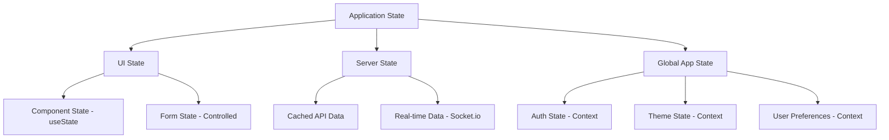

### 8.2 Context Providers

```typescript
// DataProvider Context Structure
interface AppState {
  user: UserProfile | null;
  theme: 'light' | 'dark';
  locale: string;
  isAuthenticated: boolean;
}

interface AppActions {
  login: (credentials: Credentials) => Promise<void>;
  logout: () => void;
  updateProfile: (data: Partial<UserProfile>) => Promise<void>;
  toggleTheme: () => void;
}

const DataContext = createContext<AppState & AppActions>(null);
```

### 8.3 State Update Patterns

```typescript
// Optimistic Updates
const updateBookmark = async (id: string, data: BookmarkData) => {
  // 1. Optimistically update UI
  setBookmarks(prev => prev.map(b => b.id === id ? {...b, ...data} : b));
  
  try {
    // 2. Send to server
    await api.updateBookmark(id, data);
  } catch (error) {
    // 3. Rollback on error
    setBookmarks(prev => prev.map(b => b.id === id ? originalBookmark : b));
    showError('Failed to update bookmark');
  }
};
```

---

## 9. Performance Optimization

### 9.1 Build Optimization

```javascript
// vite.config.ts
export default defineConfig({
  build: {
    rollupOptions: {
      output: {
        manualChunks: {
          'vendor': ['react', 'react-dom', 'react-router-dom'],
          'ui': ['framer-motion', '@tailwindcss'],
          'quran': ['./modules/Quran.tsx'],
          'ai': ['@google/genai']
        }
      }
    },
    chunkSizeWarningLimit: 1000
  }
});
```

### 9.2 Code Splitting Strategy

```typescript
// Lazy loading modules
const Dashboard = lazy(() => import('./modules/Dashboard'));
const Quran = lazy(() => import('./modules/Quran'));
const SmartDeen = lazy(() => import('./modules/SmartDeen'));

// Usage with Suspense
<Suspense fallback={<LoadingSpinner />}>
  <Routes>
    <Route path="/dashboard" element={<Dashboard />} />
    <Route path="/quran" element={<Quran />} />
  </Routes>
</Suspense>
```

### 9.3 Performance Metrics

| Metric | Target | Current | Tool |
|---|---|---|---|
| **First Contentful Paint** | < 1.5s | 1.2s | Lighthouse |
| **Time to Interactive** | < 3.0s | 2.8s | Lighthouse |
```dockerfile
WORKDIR /app
COPY package*.json ./
RUN npm ci
COPY . .
RUN npm run build

FROM node:18-alpine AS runner
WORKDIR /app
COPY --from=builder /app/dist ./dist
COPY --from=builder /app/package*.json ./
RUN npm ci --production
EXPOSE 3000
CMD ["npx", "serve", "-s", "dist"]
```

### 10.2 CI/CD Pipeline

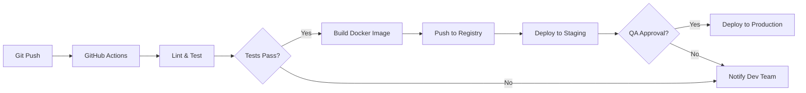

### 10.3 Environment Configuration

| Environment | URL | Purpose | Auto-Deploy |
|-------------|-----|---------|-------------|
| **Development** | localhost:5173 | Local development | Manual |
| **Staging** | staging.quranpulse.app | QA testing | On PR merge |
| **Production** | quranpulse.app | Live users | On release tag |

---

## 11. Scalability & High Availability

### 11.1 Horizontal Scaling

Supabase handles horizontal scaling automatically for the database and auth layer. The frontend is served via CDN (Vercel/Netlify/Cloudflare) which scales globally.

### 11.2 Database Scaling

**Supabase Configuration:**
- **Read Replicas**: Can be enabled for high-read workloads.
- **Connection Pooling**: PgBouncer is configured for efficient connection management.

```

### 11.3 Failover Strategy

| Component | Strategy | Recovery Time |
|-----------|----------|---------------|
| **Application** | Multi-instance deployment with health checks | < 5 seconds |
| **Database** | Automatic replica set failover | < 30 seconds |
| **Cache** | Redis Sentinel with automatic failover | < 10 seconds |
| **Load Balancer** | Active-passive HAProxy setup | < 1 minute |

---

## 12. Monitoring & Observability

### 12.1 Logging Strategy

```typescript
// Structured logging with Winston
import winston from 'winston';

const logger = winston.createLogger({
  level: 'info',
  format: winston.format.combine(
    winston.format.timestamp(),
    winston.format.json()
  ),
  transports: [
    new winston.transports.File({ filename: 'error.log', level: 'error' }),
    new winston.transports.File({ filename: 'combined.log' })
  ]
});

// Usage
logger.info('User login', { userId, timestamp, ip });
logger.error('Database connection failed', { error, service: 'mongodb' });
```

### 12.2 Metrics Collection

**Key Metrics to Track:**

| Category | Metrics | Tool |
|----------|---------|------|
| **Application** | Request rate, error rate, latency | Prometheus |
| **Infrastructure** | CPU, memory, disk, network | Node Exporter |
| **Database** | Query time, connections, replication lag | MongoDB Exporter |
| **User** | Active users, session duration, engagement | Google Analytics |

### 12.3 Health Check Endpoints

```typescript
// /health - Basic health check
app.get('/health', (req, res) => {
  res.json({ status: 'ok', timestamp: new Date() });
});

// /health/detailed - Comprehensive health check
app.get('/health/detailed', async (req, res) => {
  const checks = {
    database: await checkDatabase(),
    redis: await checkRedis(),
    externalAPIs: await checkExternalAPIs()
  };
  
  const isHealthy = Object.values(checks).every(c => c.status === 'ok');
  res.status(isHealthy ? 200 : 503).json(checks);
});
```

---

## Appendix

### A. Glossary

| Term | Definition |
|------|------------|
| **SPA** | Single Page Application - web app that loads a single HTML page |
| **JWT** | JSON Web Token - stateless authentication mechanism |
| **ODM** | Object-Document Mapper - abstracts database operations |
| **PWA** | Progressive Web App - web app with native-like features |
| **CSP** | Content Security Policy - prevents XSS attacks |

### B. References

- [React Documentation](https://react.dev/)
- [MongoDB Best Practices](https://docs.mongodb.com/manual/administration/production-notes/)
- [OWASP Security Guidelines](https://owasp.org/www-project-top-ten/)
- [Web.dev Performance Guide](https://web.dev/performance/)

### C. Change Log

| Version | Date | Changes |
|---------|------|---------|
| 1.2 | 2025-11-28 | Added deployment, monitoring, and scalability sections |
| 1.1 | 2025-11-25 | Enhanced security and API design documentation |
| 1.0 | 2025-11-20 | Initial architecture documentation |

---

**Document Status:** ✅ Approved  
**Next Review Date:** 2025-12-28
