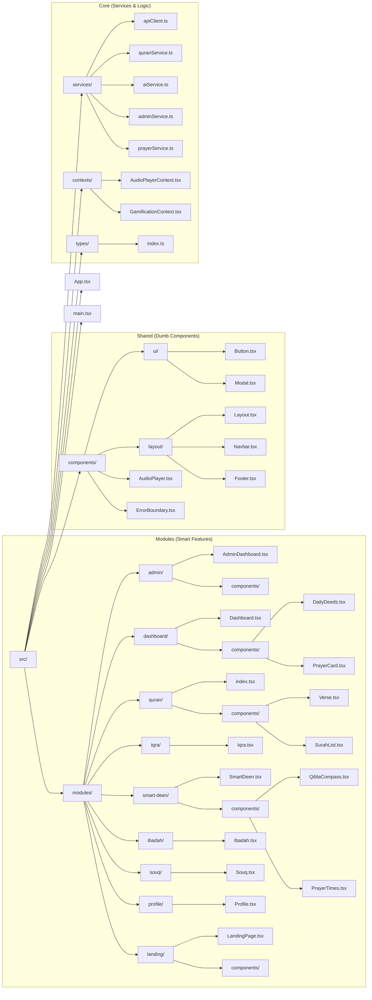

# 🌌 QURAN PULSE v6.0 — ADVANCED SYSTEM ARCHITECTURE

> **Version:** 6.0.3 (Genesis)
> **Status:** Production Blueprint
> **Architecture Pattern:** Modular Monolith (PWA) + Serverless Edge
> **Compliance:** JAKIM Act 326 Ready

---

## 1. 🏗️ HIGH-LEVEL ARCHITECTURE (C4 Level 1)

QuranPulse is strictly designed as a **"Privacy-First, Offline-Capable, Islamic Super App"**.

```mermaid
graph TB
    subgraph "The Ummah (Users)"
        User[End User]
        Scholar[Islamic Scholar]
        Admin[Super Admin]
    end

    subgraph "QuranPulse Ecosystem"
        WebApp[QuranPulse PWA<br/>(React/Vite)]
        EdgeAPI[Edge Functions<br/>(Supabase/Vercel)]
        VectorDB[AI Knowledge Base<br/>(pgvector)]
    end

    subgraph "External Systems"
        JAKIM[JAKIM e-Solat & Halal API]
        Zhipu[Zhipu AI (GLM-4)]
        CDN[Media CDN (Evaluated Sounds)]
    end

    User -->|Reads/Learns| WebApp
    Scholar -->|Verifies| WebApp
    Admin -->|Manages| WebApp

    WebApp -->|Syncs Data| EdgeAPI
    WebApp -->|Semantic Search| VectorDB
    
    EdgeAPI -->|Verifies Compliance| JAKIM
    EdgeAPI -->|Generates Wisdom| Zhipu
    WebApp -->|Streams Audio| CDN
```

---

## 2. 🗺️ CODEBASE TOPOGRAPHY (Complete File Map)

This diagram represents the **Target State** of the file system after reorganization.



---

## 3. 🧩 MODULAR MONOLITH STRUCTURE (Explanation)

| Layer | Directory | Responsibility | Coupling |
| :--- | :--- | :--- | :--- |
| **App** | `src/` | Entry point, Providers, Routing. | High |
| **Modules** | `src/modules/*` | **Self-contained features.** Each module (e.g., `quran`, `admin`) owns its components, hooks, and logic. | **Low** (Loose) |
| **Shared** | `src/components/*` | "Dumb" UI components used across modules (Buttons, Modal, Layout). | High |
| **Core** | `src/services/*` | Business logic, API clients, Singleton services. | High |

---

## 4. 🧠 ARTIFICIAL INTELLIGENCE PIPELINE (RAG)

The "Ustaz AI" feature uses a **Retrieval-Augmented Generation (RAG)** pipeline.

```mermaid
sequenceDiagram
    participant User
    participant App as Client (PWA)
    participant Vector as Vector DB (Fatwa/Quran)
    participant LLM as Zhipu AI (GLM-4)
    participant Guard as Shariah Guard (Regex/Filter)

    User->>App: "Hukum trade forex?"
    
    rect rgb(20, 20, 30)
        Note right of App: PHASE 1: Retrieval
        App->>Vector: Embedding Search (Cosine Similarity)
        Vector-->>App: Returns: [Fatwa #123, Hadith #456]
    end
    
    rect rgb(30, 20, 20)
        Note right of App: PHASE 2: Augmentation
        App->>LLM: Prompt + {Context: Fatwa #123}
        LLM-->>App: Generated Draft Answer
    end

    rect rgb(20, 30, 20)
        Note right of App: PHASE 3: Safety
        App->>Guard: Check for Banned Keywords / Hallucinations
        Guard-->>App: Status: SAFE
    end

    App->>User: Display Answer + Source Citations
```



---

## 5. 🔒 SECURITY & COMPLIANCE ARCHITECTURE

### A. Data Integrity (Act 326)
*   **SHA-256 Checksums:** Every Quran page/Surah JSON is hashed. The client verifies this hash against the manifest on load to prevent tampering.
*   **Immutable Storage:** Quran text is stored in Read-Only Edge Storage, accessible ONLY via signed URLs.

### B. Row Level Security (RLS)
Supabase RLS is the primary firewall. No server-side code needed for basic protection.

```sql
-- POLICY: User Data Isolation
CREATE POLICY "Users access own data only"
ON profiles
FOR ALL
USING (auth.uid() = id);

-- POLICY: Official Data Read-Only
CREATE POLICY "Public Read Official Data"
ON official_mosques
FOR SELECT
USING (true); -- No INSERT/UPDATE allowed for public
```

---

## 6. 🌐 DATA INGESTION PIPELINE (Official Data)

How we populate `official_mosques` and `halal_directory`.

```mermaid
graph LR
    subgraph "Sources"
        Gov[e-Solat Portal]
        Halal[SmartHalal Portal]
    end

    subgraph "ETL Process (Python Scripts)"
        Scraper[Scraper/API Fetcher] --> Cleaner[Data Normalizer]
        Cleaner --> Geo[Geocoding (Lat/Long fixes)]
    end

    subgraph "Destination"
        DB[(Supabase DB)]
    end

    Gov --> Scraper
    Halal --> Scraper
    Geo --> DB
```

---
**Prepared by:** QuranPulse Architecture Team
**Last Verified:** Dec 6, 2025
