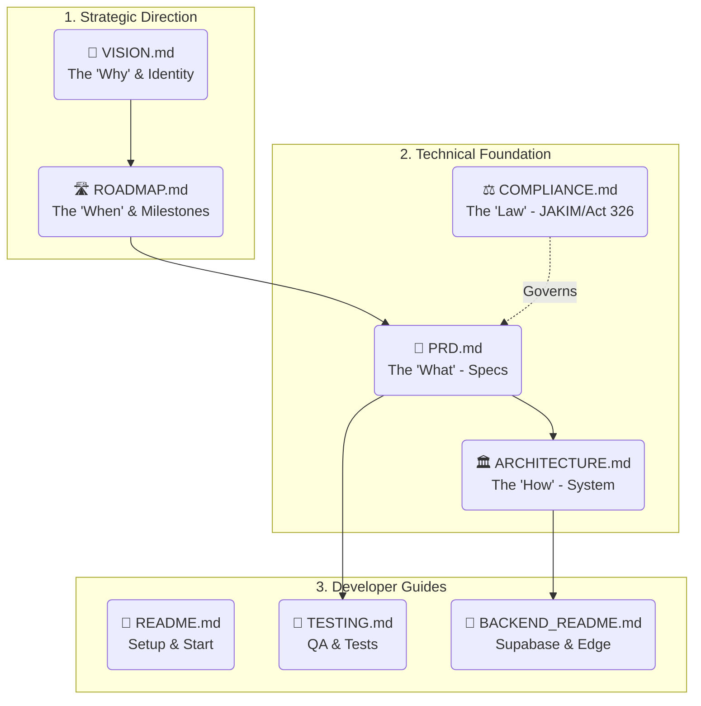

# 📚 QuranPulse Project Documentation

Welcome to the **QuranPulse v6.0** knowledge base. Use this index to navigate our project documentation.

## 🗺️ Documentation Map

## 🧭 Strategic Direction (Hala Tuju)
Where are we going and why?
- **[🔭 VISON & MANIFESTO](./VISION.md)**: The "Soul" of the project. Our Mission and "Cyber-Islamic" Identity.
- **[🛣️ ROADMAP](./ROADMAP.md)**: The "Time". Phases, milestones, and deadlines.

## 🏗️ Technical Foundation
How are we building it?
- **[📘 PRODUCT REQUIREMENTS (PRD)](./PRD.md)**: The "Bible". Comprehensive specifications for every feature.
- **[🏛️ ARCHITECTURE](./Architecture.md)**: The "Skeleton". System diagrams, tech stack, and data flow.
- **[⚖️ COMPLIANCE GUIDELINES](./COMPLIANCE_GUIDELINES.md)**: The "Law". JAKIM Act 326 standards and sacred text handling.

## 🛠️ Developer Guides
How do I contribute?
- **[🚀 README](./README.md)**: Getting started, installation, and setup.
- **[🧪 TESTING](./TESTING.md)**: How to run tests and ensure quality.
- **[🤖 BACKEND GUIDE](./BACKEND_README.md)**: Supabase and Edge Function details.

---
> *Tip: Start with `VISION.md` to understand the "Why", then `ROADMAP.md` for the "When", and `PRD.md` for the "What".*
