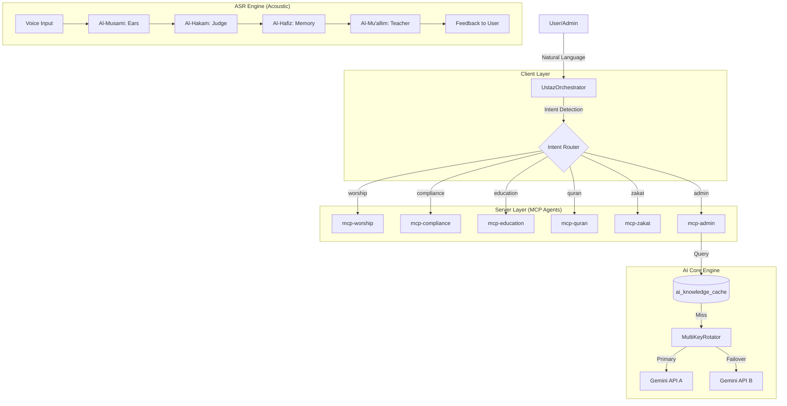
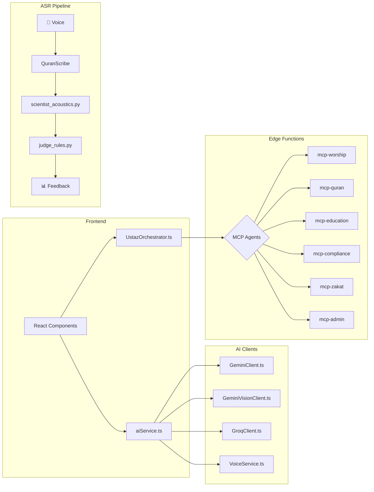

# 🤖 QuranPulse Agent System (Unified)

> **"Ustaz as an OS"** - The future of Islamic AI Intelligence, bridging faith with technology.

---

## 1. Architecture Overview



---

## 2. Core AI Engine (NiagaHub Pattern)

The AI layer follows NiagaHub's **AdkRunner + AdkAgent** separation of concerns:

### 2.1 AdkRunner (Orchestrator)
**Location:** `src/lib/ai/AdkRunner.ts`

```typescript
class AdkRunner {
  async ask(question: string): Promise<string> {
    // 1. Generate cache key (SHA256 hash)
    const cacheKey = generateCacheKey(question);
    
    // 2. Check cache first (Redis/Supabase)
    const cached = await cache.get(cacheKey);
    if (cached) return cached;  // ⚡ HIT
    
    // 3. Call Agent on cache miss
    const response = await agent.generateResponse(question);
    
    // 4. Save to cache (TTL: 24h)
    await cache.set(cacheKey, response, TTL);
    return response;
  }
}
```

### 2.2 AdkAgent (Worker + Key Rotation)
**Location:** `src/lib/ai/AdkAgent.ts`

```typescript
class AdkAgent {
  async generateResponse(prompt: string): Promise<string> {
    // Try each API key with auto-failover
    for (const key of API_KEYS) {
      try {
        const result = await gemini.generateContent(prompt);
        return result.text();  // ✅ Success
      } catch {
        continue;  // ⚠️ Try next key
      }
    }
    throw new Error('All API keys failed');  // 🔥 Total failure
  }
}
```

### 2.3 QuranPulse Mapping

| NiagaHub | QuranPulse Equivalent | Notes |
|----------|----------------------|-------|
| `AdkRunner.ask()` | `UstazOrchestrator.detectAndCall()` | Intent routing + delegation |
| `AdkAgent` | `MultiKeyRotator` in chat-proxy | Key rotation logic |
| Redis Cache | `ai_knowledge_cache` (Postgres) | Consider edge caching |
| `AdkAgent.generateResponse()` | Gemini API calls in Edge Functions | Per-agent AI calls |

---

## 2A. Core AI Services (`src/services/ai/`)

### LLM Clients

| File | Purpose | Model |
|------|---------|-------|
| `GeminiClient.ts` | Primary LLM | Gemini 2.5 Flash |
| `GeminiVisionClient.ts` | Image analysis | Gemini Vision |
| `GroqClient.ts` | Fast inference | Llama 3 / Mixtral |
| `MultiKeyRotator.ts` | API key failover | Multi-key rotation |
| `KeyManager.ts` | Key lifecycle | Key validation |

### Voice & Speech

| File | Purpose | Model |
|------|---------|-------|
| `VoiceService.ts` | Speech synthesis | Google TTS / Web Speech API |
| `prompts.ts` | System prompts | N/A |

### Main AI Service (`aiService.ts`)

```typescript
// Key functions in aiService.ts (625 lines):
askUstazAI()              // Main chat endpoint with personas
analyzeQuranRecitation()  // ASR analysis with scoring
chatWithVerseContext()    // Context-aware verse chat
getHadithByTopic()        // Topic-based hadith lookup
getTafsirForVerse()       // Verse tafsir retrieval
generateSpeech()          // TTS generation
```

**Features:**
- 🔄 Circuit Breaker (auto-recovery on failures)
- 💾 Supabase Cache (`ai_knowledge_cache`)
- 👤 Persona System (multiple AI personalities)

---

## 2B. Whisper ASR (`prototypes/asr_engine/`)

### QuranScribe - Quran-Optimized Whisper

| File | Role | Description |
|------|------|-------------|
| `scribe_whisper.py` | **The Scribe** | `IJyad/whisper-large-v3-Tarteel` model |
| `scientist_acoustics.py` | Acoustic Analysis | Formant & pitch extraction |
| `judge_rules.py` | Rule Evaluator | Tajweed rule checking |
| `analyst_mfa.py` | MFA Analysis | Forced alignment |
| `server.py` | API Server | FastAPI endpoints |
| `service.py` | Orchestrator | Pipeline coordination |

```python
# scribe_whisper.py - Quran-optimized transcription
class QuranScribe:
    model_id = "IJyad/whisper-large-v3-Tarteel"  # Tarteel-trained
    
    def transcribe(self, audio_path):
        return self.pipe(audio_path, generate_kwargs={"language": "arabic"})
```

## 3. Client-Side Orchestrator

### UstazOrchestrator (`src/services/UstazOrchestrator.ts`)

| Method | Purpose |
|--------|---------|
| `detectAndCall(query, lang)` | Main entry point - routes to appropriate MCP agent |
| `isWorshipIntent(q)` | Detects prayer times/qibla queries |
| `isComplianceIntent(q)` | Detects fatwa/halal queries |
| `isEducationIntent(q)` | Detects hadith/tafsir queries |
| `isQuranIntent(q)` | Detects Quran search queries |
| `isZakatIntent(q)` | Detects zakat calculation queries |
| `isAdminIntent(q)` | **NEW** Detects admin/stats queries |

---

## 3. Server-Side MCP Agents

### 3.1 Active Agents

| Agent | Edge Function | Keywords | Status |
|-------|---------------|----------|--------|
| **Worship** | `mcp-worship` | waktu, solat, azan, subuh | ✅ Ready |
| **Compliance** | `mcp-compliance` | hukum, fatwa, halal, haram | ✅ Ready |
| **Education** | `mcp-education` | hadis, tafsir, riwayat | ✅ Ready |
| **Quran** | `mcp-quran` | ayat, surah, quran | ✅ Ready |
| **Zakat** | `mcp-zakat` | zakat, fitrah, nisab | ✅ Ready |
| **Admin** | `mcp-admin` | stats, analytics, users | 🚧 Implementing |

### 3.2 Edge Function Pattern

```typescript
// All MCP agents follow this pattern:
serve(async (req) => {
  // 1. CORS handling
  if (req.method === 'OPTIONS') return corsResponse();
  
  // 2. Parse intent & query
  const { intent, query } = await req.json();
  
  // 3. Process (DB lookup, API call, or AI)
  const result = await processIntent(intent, query);
  
  // 4. Return JSON response
  return jsonResponse(result);
});
```

---

## 4. ASR Multi-Agent System (Acoustic Engine)

For Quran recitation learning with acoustic feedback.

| Agent | Code Name | Role | Location |
|-------|-----------|------|----------|
| **Acoustic** | Al-Musami | The "Ears" - Signal processing | `modules/asr_engine/` |
| **Evaluator** | Al-Hakam | The "Judge" - Q-WER scoring | `intelligence/metrics/` |
| **Profiler** | Al-Hafiz | The "Memory" - User history | `intelligence/memory/` |
| **Pedagogy** | Al-Mu'allim | The "Teacher" - Feedback | `intelligence/pedagogy/` |

### Q-WER Error Weights
- **Makhraj (3.0x)** - Articulation errors (Critical)
- **Tajweed (2.5x)** - Rule violations
- **Harakat (2.0x)** - Vowel timing
- **Rhythm (1.0x)** - Fluency issues

---

## 5. Communication Protocol

### Message Format (JSON)

```json
{
  "timestamp": "2026-01-06T23:45:00+08:00",
  "source_agent": "UstazOrchestrator",
  "target_agent": "mcp-worship",
  "message_type": "intent_request",
  "payload": {
    "intent": "prayer_times",
    "params": { "zone": "WLP01" }
  }
}
```

### Error Handling
- **Graceful Degradation**: If agent fails, fallback to cached/mock data
- **Key Rotation**: Auto-failover on API quota exhaustion
- **Retry Logic**: 3 attempts with exponential backoff

---

## 6. Integration Map



| Service | Connects To | Purpose |
|---------|-------------|---------|
| `aiService.ts` | Gemini, Groq, Voice | Main AI orchestration |
| `GeminiClient.ts` | Gemini API | Text generation with failover |
| `GeminiVisionClient.ts` | Gemini Vision | Image analysis |
| `GroqClient.ts` | Groq API | Fast inference backup |
| `VoiceService.ts` | Web Speech API | TTS synthesis |
| `UstazOrchestrator.ts` | All MCP agents | Intent routing |
| `mcpService.ts` | All MCP agents | Legacy compatibility |
| `NiagaHubPlugin` | External API | Cross-app AI analysis |
| `QuranScribe` | Whisper Tarteel | Quran transcription |

---

## 7. Developer Workflows

See `.agent/workflows/` for Gemini CLI integration:
- `agent-admin.md` - Admin operations
- `agent-education.md` - Hadith/Tafsir
- `agent-worship.md` - Prayer times
- `agent-quran.md` - Quran search
- `agent-compliance.md` - Fatwa/Halal
- `agent-zakat.md` - Zakat calculator
- `agent-asr.md` - Voice/Acoustic

---

*Generated by Antigravity AI Architect - 2026-01-06*
