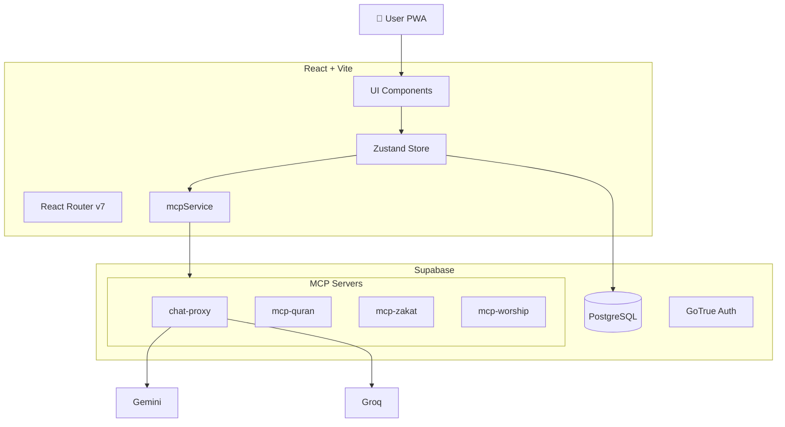

# 🏗️ System Architecture: QuranPulse v6.0

## High-Level Overview

QuranPulse v6.0 follows a **"Supabase-First" Modular Monolith** architecture. The frontend is a thick client (PWA) that communicates directly with Supabase for data and Edge Functions for compute-heavy tasks (AI).

## Core Modules

### 1. Client-Side (The "Body")
* **Framework:** React 18 with Vite for lightning-fast HMR.
* **State Management:** `zustand` for global state (User, Theme, Player).
* **MCP Service:** `mcpService.ts` acts as the client-side router, detecting user intent and dispatching to the correct domain server.

### 2. Server-Side (The "Brain")
* **Database:** PostgreSQL with Row Level Security (RLS). Optimized with **Partial Indexes** for the MCP cache layer.
* **MCP Edge Functions:** Domain-driven TypeScript/Deno functions in `supabase/functions`.
  * `chat-proxy`: Core AI orchestration and key rotation.
  * `mcp-worship`: Prayer times with JAKIM API + Adhan.js failover.
  * `mcp-quran`: Concept-based semantic search across translations.
  * `mcp-zakat`: State-specific Zakat calculation engine (MY-standard).
  * `mcp-compliance`: Halal and Fatwa lookup service.

### 3. AI Pipeline (The "Soul")
* **Text Generation:** Hybrid failover strategy (Groq/Gemini) with **Zero Token Cache** (DB lookup before LLM).
* **Testing:** Automated CI with Jest (Unit/Integration) and Playwright (E2E).

## Data Flow
1. **Read:** Client fetches JSON data (Surahs/Hadith) from `src/data` (static) or Supabase (dynamic user data).
2. **Write:** Client writes to Supabase Tables (`bookmarks`, `journal`).
3. **Compute:** Client invokes `supabase.functions.invoke('chat-proxy')` -> Edge Function calls LLM -> Streams response back.

## Security
* **RLS:** All tables provided `Enable RLS`. Users can only select/insert their own rows.
* **Env Vars:** API Keys stored in Supabase Vault not exposed to client.
* **Hardened Admin:** Strict role-based access for Admin Dashboard.

## VPS Infrastructure (srv1322432)

The production backend runs on a dedicated VPS with the following topology:

| Component | Runtime | Binding |
|-----------|---------|---------|
| OpenClaw (GangBot) | Root user systemd service | `100.100.205.64:18789` (Tailscale) |
| QuranPulse API | Docker Compose | `0.0.0.0:3000` |
| Qdrant Vector DB | Docker (in QP stack) | `0.0.0.0:6333` ⚠️ |
| Redis | Docker (in QP stack) | `127.0.0.1:6379` |

**Networking:**
* **Tailscale VPN** (`100.100.205.64`) provides private mesh access for OpenClaw.
* **Caddy** reverse proxy terminates TLS for `operator.gangniaga.my` and `api.gangniaga.my`.
* **fail2ban** active with `sshd` jail for brute-force protection.

> [!WARNING]
> Qdrant is currently bound to `0.0.0.0` — should be restricted to `127.0.0.1`.
> SSH still allows `PermitRootLogin yes` — needs hardening.

## Future Scalability
* **Microservices:** The ASR Engine is designed to be peeled off into a separate Python/FastAPI container service.
* **PWA:** Service Workers cache `quran-data` for offline reading.
