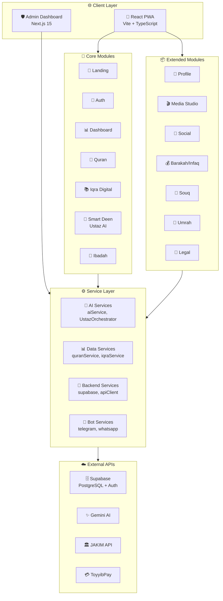
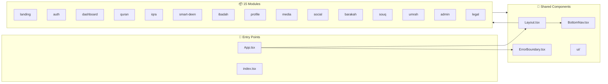
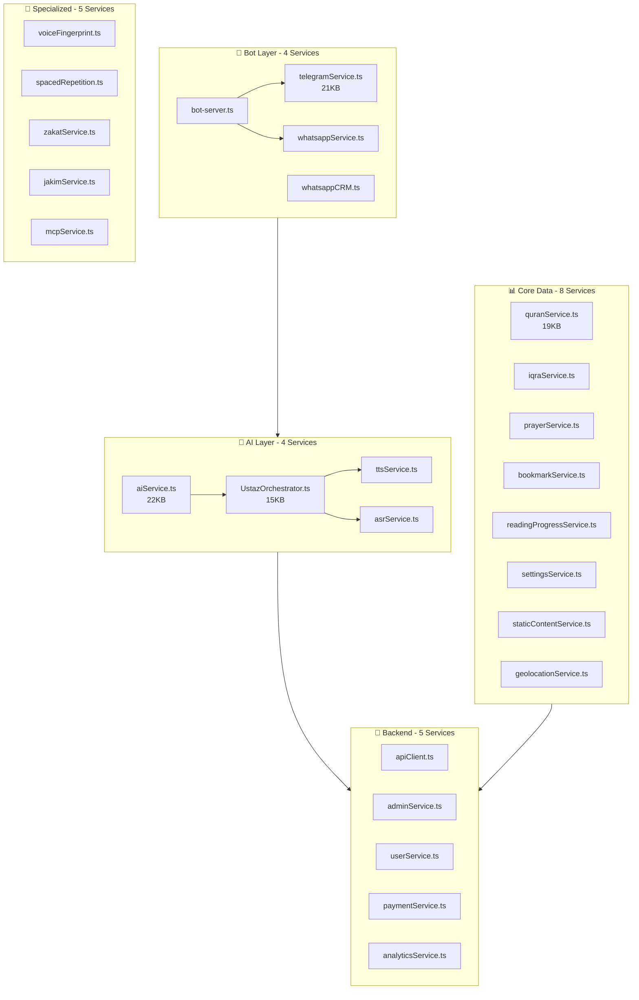
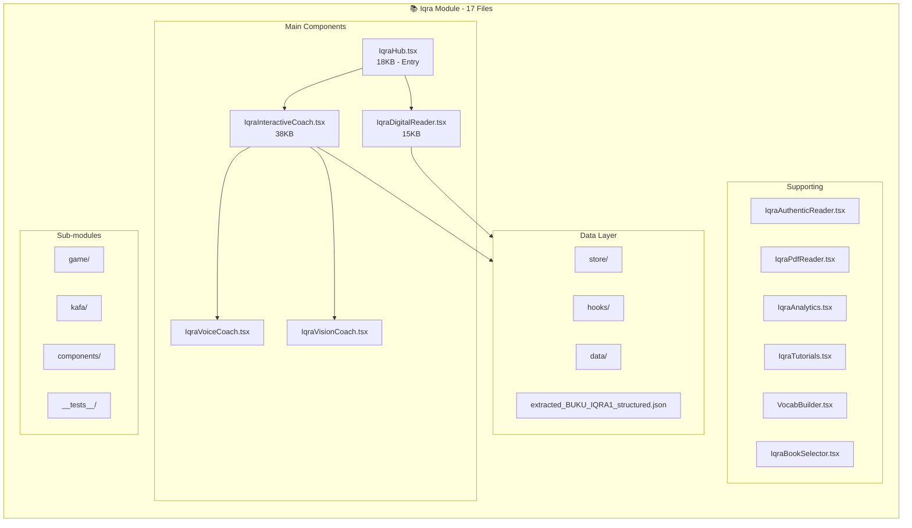
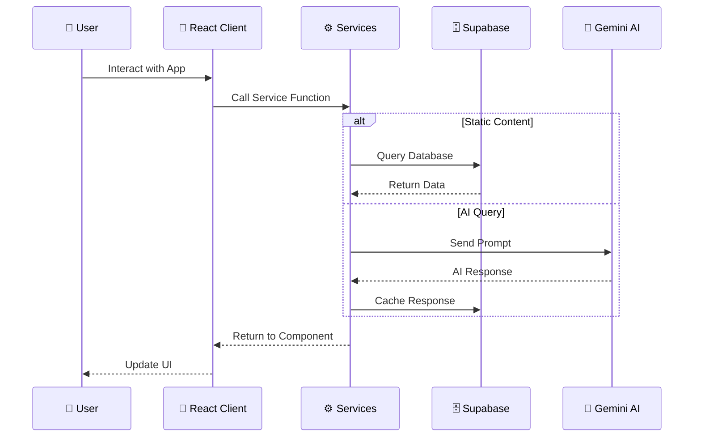
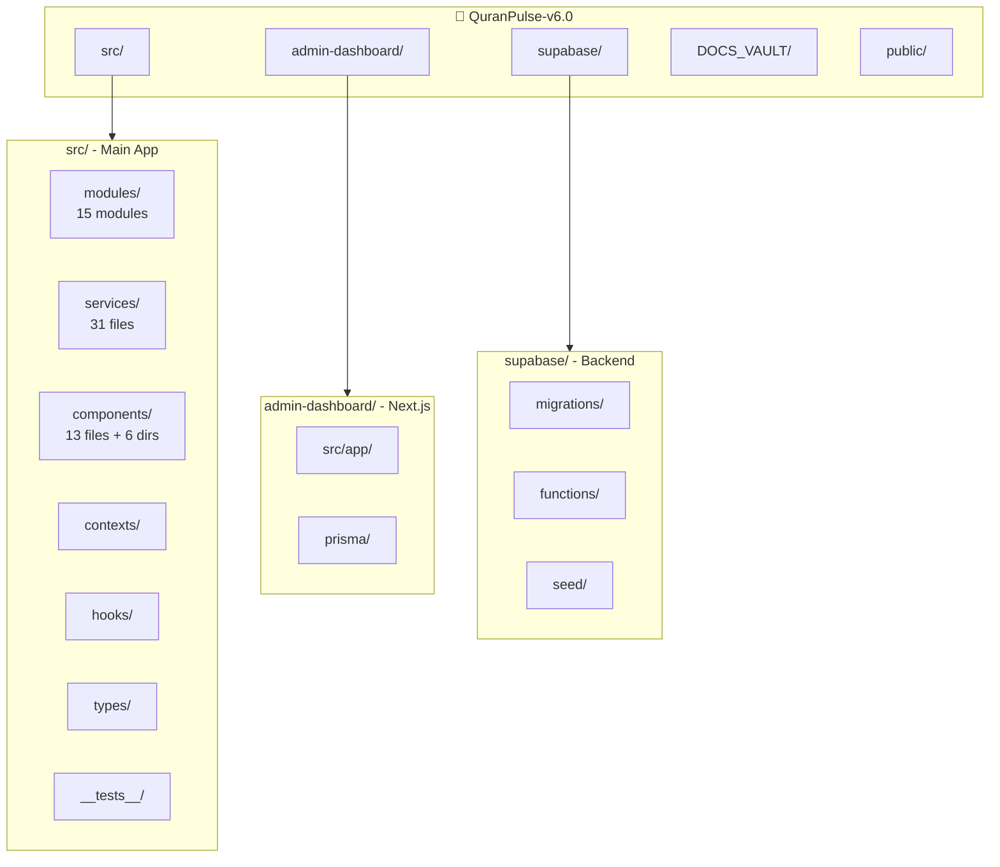
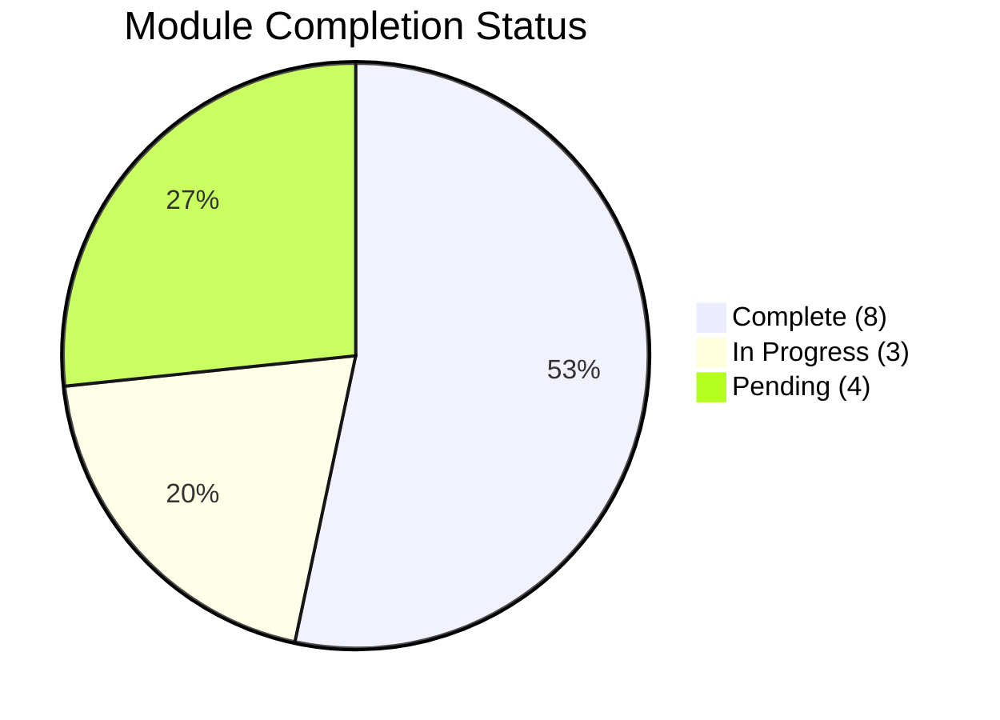
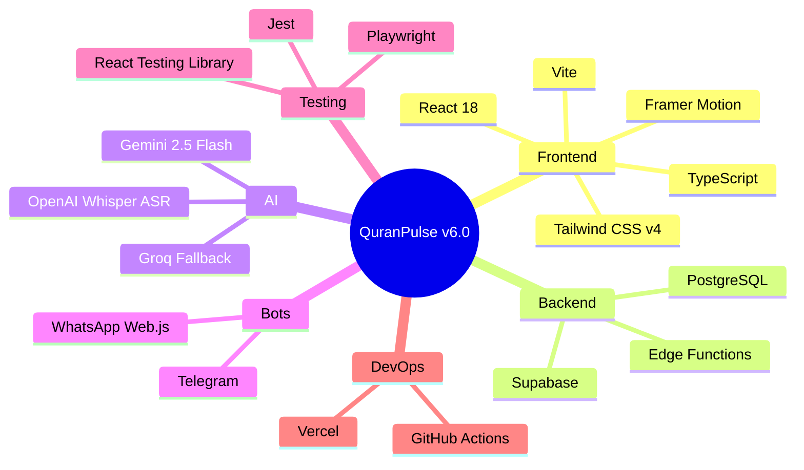

# 🏗️ QuranPulse v6.0 - Architecture Diagrams

> **Generated:** 2026-01-08
> **Based on:** Full project file structure analysis

---

## 1️⃣ High-Level System Architecture

---

## 2️⃣ Module Dependency Map

---

## 3️⃣ Services Architecture

---

## 4️⃣ Iqra Module Detail (Most Complex)

---

## 5️⃣ Data Flow Architecture

---

## 6️⃣ File Structure Tree

---

## 7️⃣ Module Status Overview

---

## 8️⃣ Technology Stack

---

**[End of Architecture Diagrams]**
