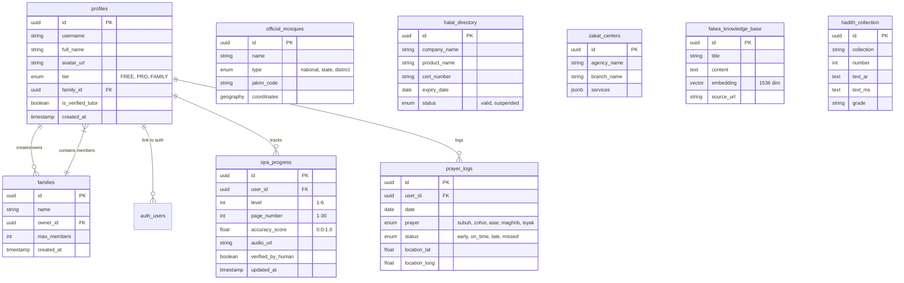

# 🗂️ QURANPULSE v6.0 ENTITY RELATIONSHIP DIAGRAM (ERD)

> **Purpose:** Visual representation of the database structure and relationships.
> **Source:** Based on `DATABASE_SCHEMA.md` and `PRD.md`.
> **Format:** Mermaid Class Diagram.

---

## 🗺️ HIGH-LEVEL ARCHITECTURE

The database is built on **Supabase (PostgreSQL)** and follows a modular "Star Schema" approach where the `profiles` table is the central hub connecting all user activities.

---

## 🔗 RELATIONSHIP KEYS

### **User & Family Dynamics**
*   **One-to-Many**: A User (`profiles.id`) can be an owner of one Family, but implies membership.
*   **Recursive**: The `family_id` column in `profiles` creates the membership link.

### **Progress Tracking**
*   **Composite Uniqueness:** For `prayer_logs`, we enforce uniqueness on `(user_id, date, prayer)` to prevents duplicate logs for the same prayer slot.
*   **Granularity:** `iqra_progress` tracks every page attempt.

### **Official Data**
*   These tables (`official_mosques`, `halal_directory`) act as **Immutable Reference Data**.
*   They are queried by location (GIS) or search string, not typically joined directly to `profiles` unless a user "favorites" an item (which would require a join table like `user_favorites`).

---

## 🛡️ DATA SECURITY MODEL
*   **RLS (Row Level Security)** is mandatory.
*   **Public Data:** Green tables (Official Data) are publicly readable.
*   **Private Data:** Blue tables (User Data) are strictly siloed by `auth.uid()`.
