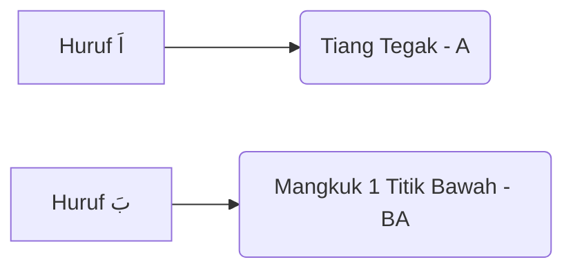

```markdown
# IQRA 1 - MASTER GUIDE

**Status**: FINAL / GOLD STANDARD
**Volume**: 1
**Focus**: Huruf Tunggal (Alif - Ya), Fathah (Baris Atas).

## Metadata

*   **Total Pages**: 21
*   **Key Concept**: "Pengenalan Huruf & Makhraj"
*   **Instruction**: "Baca terus (tanpa mengeja). Pendek sahaja (1 harakat)."
### Diagram Struktur Kotak (Grid Penuh)
| Baris | Kotak 5 (Kanan) | Kotak 4 | Kotak 3 | Kotak 2 | Kotak 1 (Kiri) | Fokus Kumpulan |
| :--- | :--- | :--- | :--- | :--- | :--- | :--- |
| **1** | ا (ALIF) | ب (BA) | ت (TA) | ث (TSA) | ج (JIM) | Asas Alif & Mangkuk. |
| **2** | ح (HA) | خ (KHO) | د (DAL) | ذ (DZAL) | ر (RO) | Perut & Lengkung. |
| **3** | ز (ZAI) | س (SIN) | ش (SYIN) | ص (SOD) | ض (DHOD) | Gigi & Mangkuk Besar. |
| **4** | ط (THO) | ظ (ZHO) | ع (AIN) | غ (GHOIN) | ف (FA) | Tiang & Kepala Burung. |
| **5** | ق (QOF) | ك (KAF) | ل (LAM) | م (MIM) | ن (NUN) | Ekor & Mangkuk Dalam. |
| **6** | و (WAU) | هـ (HA) | لا (LAM ALIF)| ء (HAMZAH)| ي (YA) | Penutup. |
---
## MUKA SURAT 3: HURUF ALIF & BA (ا - ب)
**Fokus:** Bunyi 'A' (Buka Mulut) dan 'BA' (Bibir Rapat).
### Diagram Aliran Bacaan
[ 3 ] <--- [ 2 ] <--- [ 1 ]
### Diagram Struktur Kotak (Penuh)
| Baris | Kotak Kanan (Mula) | Kotak Kiri | Fokus Latihan |
| :--- | :--- | :--- | :--- |
| **TAJUK** | **بَ (BA)** | **اَ (A)** | **Beza Tiang (A) & Mangkuk (Ba).** |
| **Baris 1** | بَ اَ بَ | اَ بَ اَ | Latihan selang-seli. |
| **Baris 2** | بَ اَ اَ | اَ اَ بَ | Pengulangan huruf sama. |
| **Baris 3** | بَ بَ اَ | اَ بَ بَ | Ba berkembar. |
| **Baris 4** | بَ اَ بَ | اَ بَ اَ | Ulangkaji pola. |
| **Baris 5** | بَ بَ بَ | اَ اَ اَ | Ketahanan bunyi. |
| **Baris 6** | اَ بَ | اَ بَ | Ujian akhir. |
### Diagram Perbandingan Karakter

---
## MUKA SURAT 4: HURUF TA (ت)
**Fokus:** Huruf TA (2 Titik Atas). Bunyi tajam "TA".
### Diagram Struktur Kotak (Penuh)

| Baris | Kotak Kanan (Mula) | Kotak Kiri | Fokus Latihan |
| :--- | :--- | :--- | :--- |
| **TAJUK** | **تَ (TA)** | **بَ (BA)** | **TA = 2 Titik Atas.** |
| **Baris 1** | اَ تَ بَ | بَ تَ اَ | Gabungan 3 huruf. |
| **Baris 2** | تَ اَ تَ | تَ اَ تَ | Ta di awal & akhir. |
| **Baris 3** | بَ تَ اَ | بَ تَ بَ | Ba vs Ta. |
| **Baris 4** | تَ اَ تَ | بَ اَ تَ | Latihan rawak. |
| **Baris 5** | اَ تَ بَ | تَ تَ اَ | Ta berganda. |
| **Baris 6** | اَ بَ تَ | اَ بَ تَ | Urutan Hijaiyah. |

---
## MUKA SURAT 5: HURUF TSA (ث)
**Fokus:** Huruf TSA (3 Titik Atas). Bunyi lembut, hujung lidah di gigi.
### Diagram Struktur Kotak (Penuh)

| Baris | Kotak Kanan (Mula) | Kotak Kiri | Fokus Latihan |
| :--- | :--- | :--- | :--- |
| **TAJUK** | **ثَ (TSA)** | **تَ (TA) - بَ (BA)** | **3 Titik = TSA.** |
| **Baris 1** | ثَ اَ بَ | ثَ بَ تَ | Tsa di awal. |
| **Baris 2** | بَ اَ ثَ | تَ ثَ بَ | Tsa di akhir & tengah. |
| **Baris 3** | ثَ بَ ثَ | اَ تَ بَ | Tsa berulang. |
| **Baris 4** | ثَ ثَ أ | تَ بَ ثَ | Tsa berganda. |
| **Baris 5** | ثَ تَ ثَ | بَ ثَ تَ | Latihan lidah (Lembut-Keras). |
| **Baris 6** | اَ بَ تَ ثَ | اَ بَ تَ ثَ | Urutan 4 huruf. |

---
## MUKA SURAT 6: HURUF JIM, HA, KHO (ج ح خ)
**Fokus:** Bentuk Perut Buncit. Ja (Titik Tengah), Ha (Kosong), Kho (Titik Atas).
### Diagram Struktur Kotak (Penuh)

| Baris | Kotak Kanan (Mula) | Kotak Kiri | Fokus Latihan |
| :--- | :--- | :--- | :--- |
| **TAJUK** | **جَ (JA)** | **حَ (HA) - خَ (KHO)** | **3 Beradik Perut.** |
| **Baris 1** | جَ اَ خَ | خَ اَ جَ | Ja (Kuat) vs Kho (Serak). |
| **Baris 2** | جَ تَ خَ | ثَ اَ خَ | Gabungan mangkuk & perut. |
| **Baris 3** | ثَ حَ ثَ | بَ حَ ثَ | Ha Pedas (tengah kerongkong). |
| **Baris 4** | ثَ جَ حَ | خَ تَ خَ | Latihan Kho dan Ja. |
| **Baris 5** | خَ حَ خَ | خَ خَ حَ | Ujian makhraj Kho/Ha. |
| **Baris 6** | اَ بَ تَ ثَ جَ حَ خَ | (Urutan Penuh) | Review. |

---
## MUKA SURAT 7: HURUF DAL & DZAL (د ذ)
**Fokus:** Bentuk Siku. Dal (Kosong), Dzal (Titik).
### Diagram Struktur Kotak (Penuh)

| Baris | Kotak Kanan (Mula) | Kotak Kiri | Fokus Latihan |
| :--- | :--- | :--- | :--- |
| **TAJUK** | **دَ (DA)** | **ذَ (DZA)** | **DZA = Lidah gigit sikit.** |
| **Baris 1** | خَ دَ ذَ | دَ اَ ذَ | Da (Kuat) vs Dza (Lembut). |
| **Baris 2** | ذَ حَ جَ | اَ حَ دَ | Dza-Ha-Ja. |
| **Baris 3** | خَ تَ دَ | ثَ اَ ذَ | Tsa dan Dza (bunyi hampir sama). |
| **Baris 4** | ذَ بَ حَ | خَ حَ جَ | Dza-Ba-Ha. |
| **Baris 5** | حَ دَ ثَ | اَ خَ دَ | Ha-Da-Tsa. |
| **Baris 6** | دَ اَ ذَ | خَ دَ ذَ | Latihan pemantapan. |
| **Baris 7** | اَ بَ تَ ثَ جَ حَ خَ دَ ذَ | (Urutan Penuh) | Review. |

---
## MUKA SURAT 8: HURUF RO & ZAI (ر ز)
**Fokus:** Bentuk Pisang/Lengkung. Ro (Kosong - Tebal), Zai (Titik - Desing).
### Diagram Struktur Kotak (Penuh)

| Baris | Kotak Kanan (Mula) | Kotak Kiri | Fokus Latihan |
| :--- | :--- | :--- | :--- |
| **TAJUK** | **رَ (RO)** | **زَ (ZA)** | **RO = Tebal ('O'), ZA = Desing.** |
| **Baris 1** | رَ اَ زَ | ذَ رَ زَ | Ro vs Dzal vs Za. |
| **Baris 2** | ذَ خَ زَ | رَ دَ رَ | Latihan selang seli. |
| **Baris 3** | ثَ رَ زَ | دَ حَ دَ | Tsa-Ro-Za. |
| **Baris 4** | تَ زَ دَ | خَ رَ جَ | Ta-Za-Da. |
| **Baris 5** | ذَ حَ ثَ | بَ زَ رَ | Dza-Ha-Tsa. |
| **Baris 6** | جَ اَ خَ | زَ اَ زَ | Ja-A-Kho. |
| **Baris 7** | اَ بَ تَ ثَ جَ حَ خَ دَ ذَ رَ زَ | (Urutan Penuh) | Review. |

---
## MUKA SURAT 9: HURUF SIN & SYIN (س ش)
**Fokus:** Bentuk Gigi 3. Sin (Kosong - Tajam), Syin (3 Titik - Hambur).
### Diagram Struktur Kotak (Penuh)

| Baris | Kotak Kanan (Mula) | Kotak Kiri | Fokus Latihan |
| :--- | :--- | :--- | :--- |
| **TAJUK** | **سَ (SA)** | **شَ (SYA)** | **SYA = Bunyi 'Shhh'.** |
| **Baris 1** | سَ اَ شَ | سَ شَ سَ | Sa vs Sya. |
| **Baris 2** | شَ ذَ تَ | سَ دَ رَ | Sya-Dza-Ta. |
| **Baris 3** | زَ حَ ثَ | خَ شَ بَ | Za-Ha-Tsa vs Kho-Sya-Ba. |
| **Baris 4** | سَ اَ شَ | رَ شَ دَ | Sya di tengah. |
| **Baris 5** | دَ خَ زَ | اَ سَ شَ | Da-Kho-Za. |
| **Baris 6** | خَ سَ دَ | شَ زَ جَ | Kho-Sa-Da. |
| **Baris 7** | ثَ جَ حَ خَ دَ ذَ رَ زَ سَ شَ | (Urutan Penuh) | Review. |

---
## MUKA SURAT 10: HURUF SOD & DHOD (ص ض)
**Fokus:** Huruf Tebal. Mangkuk besar. Sod (Kosong), Dhod (Titik).
### Diagram Struktur Kotak (Penuh)

| Baris | Kotak Kanan (Mula) | Kotak Kiri | Fokus Latihan |
| :--- | :--- | :--- | :--- |
| **TAJUK** | **صَ (SO)** | **ضَ (DHO)** | **Bunyi Tebal ('O').** |
| **Baris 1** | صَ اَ ضَ | حَ ضَ رَ | So-A-Dho. |
| **Baris 2** | شَ اَ ضَ | شَ خَ زَ | Sya vs Dho. |
| **Baris 3** | صَ حَ ثَ | صَ دَ زَ | So-Ha-Tsa. |
| **Baris 4** | سَ حَ دَ | رَ صَ دَ | Sin (Nipis) vs Sod (Tebal). |
| **Baris 5** | ثَ خَ زَ | ضَ جَ سَ | Dho-Ja-Sa. |
| **Baris 6** | صَ رَ ضَ | اَ بَ تَ ثَ جَ حَ خَ | Review Awal. |
| **Baris 7** | دَ ذَ رَ زَ سَ شَ صَ ضَ | (Urutan Tebal) | Review. |

---
## MUKA SURAT 11: HURUF THO & ZHO (ط ظ)
**Fokus:** Huruf Bertiang. Bunyi Tebal.
### Diagram Struktur Kotak (Penuh)

| Baris | Kotak Kanan (Mula) | Kotak Kiri | Fokus Latihan |
| :--- | :--- | :--- | :--- |
| **TAJUK** | **طَ (THO)** | **ظَ (ZHO)** | **Tho (Kuat), Zho (Lidah keluar).** |
| **Baris 1** | ظَ اَ طَ | بَ طَ ظَ | Zho-A-Tho. |
| **Baris 2** | سَ ضَ طَ | دَ صَ طَ | Sin-Dhod-Tho. |
| **Baris 3** | شَ اَ ظَ | سَ رَ صَ | Sya-A-Zho. |
| **Baris 4** | ثَ رَ ضَ | زَ خَ ضَ | Tsa-Ro-Dhod. |
| **Baris 5** | صَ دَ شَ | جَ طَ ظَ | So-Da-Sya. |
| **Baris 6** | اَ بَ تَ ثَ جَ حَ خَ دَ ذَ | Review Awal. |
| **Baris 7** | رَ زَ سَ شَ صَ ضَ طَ ظَ | Review Akhir. |

---
## MUKA SURAT 12: HURUF 'AIN & GHOIN (ع غ)
**Fokus:** Kepala Burung. 'Ain (Tengah Kerongkong), Ghoin (Atas Kerongkong/Serak).
### Diagram Struktur Kotak (Penuh)

| Baris | Kotak Kanan (Mula) | Kotak Kiri | Fokus Latihan |
| :--- | :--- | :--- | :--- |
| **TAJUK** | **غَ (GHO)** | **عَ ('A)** | **'A = Nyaring, GHO = Serak.** |
| **Baris 1** | غَ اَ عَ | دَ غَ ظَ | Gho-A-'A. |
| **Baris 2** | ثَ عَ ظَ | جَ غَ ظَ | Tsa-'A-Zho. |
| **Baris 3** | حَ رَ ظَ | شَ غَ ضَ | Ha-Ro-Zho. |
| **Baris 4** | زَ خَ ظَ | ضَ ت غَ | Zai-Kho-Zho. |
| **Baris 5** | شَ رَ ظَ | طَ عَ بَ | Sya-Ro-Zho. |
| **Baris 6** | اَ بَ تَ ثَ جَ حَ خَ دَ ذَ رَ زَ | Review. |
| **Baris 7** | سَ شَ صَ ضَ طَ ظَ عَ غَ | Review Tebal/Halqi. |

---
## MUKA SURAT 13: HURUF FA & QOF (ف ق)
**Fokus:** Kepala Bulat. Fa (1 Titik), Qof (2 Titik - Tebal).
### Diagram Struktur Kotak (Penuh)

| Baris | Kotak Kanan (Mula) | Kotak Kiri | Fokus Latihan |
| :--- | :--- | :--- | :--- |
| **TAJUK** | **قَ (QO)** | **فَ (FA)** | **Fa = Angin, Qo = Tebal.** |
| **Baris 1** | قَ بَ ضَ | قَ طَ فَ | Qo-Ba-Dho. |
| **Baris 2** | ثَ غَ ظَ | سَ عَ فَ | Tsa-Gho-Zho. |
| **Baris 3** | حَ ذَ خَ | قَ فَ صَ | Ha-Dza-Kho. |
| **Baris 4** | ضَ غَ طَ | شَ فَ قَ | Dho-Gho-Tho (Semua tebal). |
| **Baris 5** | اَ بَ تَ ثَ  جَ حَ خَ دَ ذَ | Review. |
| **Baris 6** | رَ زَ | سَ شَ | صَ ضَ | Review. |
| **Baris 7** | طَ ظَ | عَ غَ | فَ قَ | Review Akhir. |

---
## MUKA SURAT 14: HURUF KAF (ك)
**Fokus:** Bentuk unik (ada hamzah kecil). Bunyi nipis "KA".
### Diagram Struktur Kotak (Penuh)

| Baris | Kotak Kanan (Mula) | Kotak Kiri | Fokus Latihan |
| :--- | :--- | :--- | :--- |
| **TAJUK** | **ك (KA)** | - | **Bunyi KA ada angin (Hams).** |
| **Baris 1** | كَ حَ قَ | كَ قَ خَ | Ka (Nipis) vs Qo (Tebal). |
| **Baris 2** | جَ كَ تَ | عَ طَ ف | Ja-Ka-Ta. |
| **Baris 3** | صَ دَ ثَ | قَ كَ ف | So-Da-Tsa. |
| **Baris 4** | غَ فَ كَ | زَ كَ طَ | Gho-Fa-Ka. |
| **Baris 5** | اَ بَ تَ ثَ جَ حَ خَ دَ ذَ | Review. |
| **Baris 6** | رَ زَ سَ شَ صَ ضَ طَ ظَ | Review. |
| **Baris 7** | عَ غَ فَ قَ كَ | Urutan baru. |

---
## MUKA SURAT 15: HURUF LAM (ل)
**Fokus:** Bentuk mata kail.
### Diagram Struktur Kotak (Penuh)

| Baris | Kotak Kanan (Mula) | Kotak Kiri | Fokus Latihan |
| :--- | :--- | :--- | :--- |
| **TAJUK** | **لَ (LA)** | - | **Bunyi Jelas.** |
| **Baris 1** | قَ بَ لَ | جَ عَ لَ | Qo-Ba-La. |
| **Baris 2** | ذَ كَ رَ | غَ لَ ظَ | Dza-Ka-Ro vs Gho-La-Zho. |
| **Baris 3** | حَ لَ فَ | دَ غَ سَ | Ha-La-Fa. |
| **Baris 4** | ضَ رَ عَ | زَ تَ ظَ | Dho-Ro-'A. |
| **Baris 5** | اَ بَ تَ ثَ جَ حَ خَ دَ ذَ | Review. |
| **Baris 6** | رَ زَ سَ شَ صَ ضَ | Review. |
| **Baris 7** | طَ ظَ عَ غَ فَ قَ كَ لَ | Urutan baru. |

---
## MUKA SURAT 16: HURUF MIM (م)
**Fokus:** Kepala bulat ekor ke bawah. Bunyi Bibir.
### Diagram Struktur Kotak (Penuh)

| Baris | Kotak Kanan (Mula) | Kotak Kiri | Fokus Latihan |
| :--- | :--- | :--- | :--- |
| **TAJUK** | **مَ (MA)** | - | **Bibir rapat.** |
| **Baris 1** | غَ مَ ضَ | لَ مَ سَ | Gho-Ma-Dho. |
| **Baris 2** | فَ رَ ضَ | كَ رَ مَ | Fa-Ro-Dho. |
| **Baris 3** | صَ دَ مَ | ظَ تَ ذَ | So-Da-Ma. |
| **Baris 4** | شَ مَ لَ | فَ كَ حَ | Sya-Ma-La. |
| **Baris 5** | اَ بَ تَ ثَ جَ حَ خَ دَ ذَ | Review. |
| **Baris 6** | رَ زَ سَ شَ صَ ضَ طَ ظَ | Review. |
| **Baris 7** | عَ غَ فَ قَ كَ لَ مَ | Urutan baru. |

---
## MUKA SURAT 17: HURUF NUN (ن)
**Fokus:** Mangkuk 1 Titik ATAS.
### Diagram Struktur Kotak (Penuh)

| Baris | Kotak Kanan (Mula) | Kotak Kiri | Fokus Latihan |
| :--- | :--- | :--- | :--- |
| **TAJUK** | **نَ (NA)** | - | **Bunyi Hidung.** |
| **Baris 1** | نَ ظَ فَ | نَ غَ شَ | Na-Zho-Fa. |
| **Baris 2** | صَ مَ ضَ | قَ رَ نَ | So-Ma-Dho. |
| **Baris 3** | زَ مَ نَ | كَ ذَ بَ | Za-Ma-Na. |
| **Baris 4** | كَ نَ سَ | لَ حَ ظَ | Ka-Na-Sa. |
| **Baris 5** | اَ بَ تَ ثَ جَ حَ خَ دَ ذَ | Review. |
| **Baris 6** | رَ زَ سَ شَ صَ ضَ طَ ظَ | Review. |
| **Baris 7** | عَ غَ فَ قَ كَ لَ مَ نَ | Urutan baru. |

---
## MUKA SURAT 18: HURUF WAU (و)
**Fokus:** Muncung Bibir.
### Diagram Struktur Kotak (Penuh)

| Baris | Kotak Kanan (Mula) | Kotak Kiri | Fokus Latihan |
| :--- | :--- | :--- | :--- |
| **TAJUK** | **وَ (WA)** | - | **Muncung "WA".** |
| **Baris 1** | وَ زَ رَ | وَ لَ غَ | Wa-Za-Ro. |
| **Baris 2** | فَ طَ نَ | قَ وَ مَ | Fa-Tho-Na. |
| **Baris 3** | كَ وَ نَ | سَ كَ تَ | Ka-Wa-Na. |
| **Baris 4** | شَ وَ لَ | ذَ حَ ضَ | Sya-Wa-La. |
| **Baris 5** | اَ بَ تَ ثَ جَ حَ خَ دَ ذَ | Review. |
| **Baris 6** | رَ زَ سَ شَ صَ ضَ طَ ظَ | Review. |
| **Baris 7** | عَ غَ فَ قَ كَ لَ مَ نَ وَ | Urutan baru. |

---
## MUKA SURAT 19: HURUF HA (هـ)
**Fokus:** Simpul. Bunyi Dada.
### Diagram Struktur Kotak (Penuh)

| Baris | Kotak Kanan (Mula) | Kotak Kiri | Fokus Latihan |
| :--- | :--- | :--- | :--- |
| **TAJUK** | **هَ (HA)** | - | **Bunyi Berat.** |
| **Baris 1** | هَ مَ شَ | جَ هَ دَ | Ha-Ma-Sya. |
| **Baris 2** | فَ خَ ع | طَ هَ رَ | Fa-Kho-'A. |
| **Baris 3** | وَ هَ ظَ | كَ مَ نَ | Wa-Ha-Zho. |
| **Baris 4** | سَ هَ لَ | ذَ غَ صَ | Sa-Ha-La. |
| **Baris 5** | اَ بَ تَ ثَ جَ حَ خَ دَ ذَ | Review. |
| **Baris 6** | رَ زَ سَ شَ صَ ضَ طَ ظَ | Review. |
| **Baris 7** | عَ غَ فَ قَ كَ لَ مَ nَ وَ هَ | Urutan baru. |

---
### Page 2: HURUF HIJAIYAH (Reference Chart)

* **Focus**: Reference Chart (Read Right to Left)
* **Layout**: 4-Column Grid (Mapped to Kanan/Kiri for 2-col view)

| Baris | Kotak Kanan (Mula) | Kotak Kiri | Nota Pengajar |
| :--- | :--- | :--- | :--- |
| **1** | ت ث | ا ب | Alif - Tsa |
| **2** | خ د | ج ح | Jim - Dal |
| **3** | ز س | ذ ر | Dzal - Sin |
| **4** | ص ض | ش ص | Syin - Dhod |
| **5** | ظ ع | ط ظ | Tho - 'Ain |
| **6** | ف ق | غ ف | Ghoin - Qof |
| **7** | ل م | ك ل | Kaf - Mim |
| **8** | و هـ | ن و | Nun - Ha |
| **9** | ي | ء ي | Hamzah - Ya |

---

### Page 3: HURUF BERBARIS (A - BA)
## MUKA SURAT 20: HURUF YA (ي)
**Fokus:** Titik 2 Bawah.
### Diagram Struktur Kotak (Penuh)

| Baris | Kotak Kanan (Mula) | Kotak Kiri | Fokus Latihan |
| :--- | :--- | :--- | :--- |
| **TAJUK** | **يَ (YA)** | - | **Bunyi YA.** |
| **Baris 1** | ضَ يَ رَ | ضَ حَ يَ | Dho-Ya-Ro. |
| **Baris 2** | سَ يَ غَ | وَ كَ لَ | Sa-Ya-Gho. |
| **Baris 3** | طَ هَ ظَ | شَ يَ عَ | Tho-Ha-Zho. |
| **Baris 4** | هَ ى مَ | جَ ذَ ثَ | Ha-Ya-Ma. |
| **Baris 5** | اَ بَ تَ ثَ جَ حَ خَ دَ ذَ رَ زَ | Review Awal. |
| **Baris 6** | GHO - A - ZHO - THO - DHO - SO - SYA - SA | Review Tengah. |
| **Baris 7** | YA - HA - WA - NA - MA - LA - KA - QO - FA | Review Akhir. |

---
## MUKA SURAT 21: UJIAN AKHIR (SUSUNAN BARIS)
**Fokus:** Kelancaran 100% semua huruf.
### Diagram Struktur Kotak (Penuh)

| Baris | Bacaan (Kanan ke Kiri) |
| :--- | :--- |
| **1** | اَ بَ تَ ثَ جَ حَ خَ دَ ذَ رَ زَ |
| **2** | سَ شَ صَ ضَ طَ ظَ عَ غَ |
| **3** | فَ قَ كَ لَ مَ نَ وَ هَ ءَ ى |
| **4** | ى ءَ هَ وَ نَ مَ لَ كَ قَ فَ | (Terbalik) |
| **5** | غَ عَ ظَ طَ ضَ صَ شَ سَ | (Terbalik) |
| **6** | زَ رَ ذَ دَ خَ حَ جَ ثَ تَ بَ اَ | (Terbalik) |
**TAHNIAH! ANDA TAMAT IQRA 1.**

```
