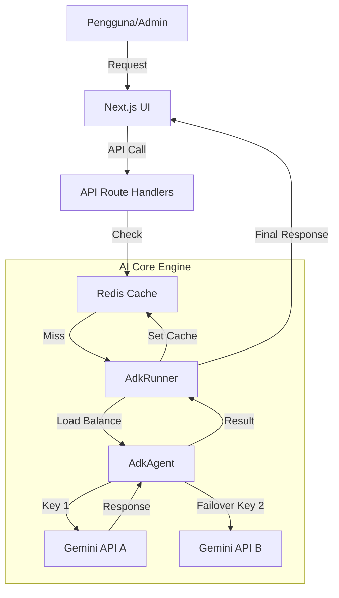

# Architecture Documentation

## 1. High-Level Overview

Sistem ini menggunakan seni bina **Modern Monolith** (Next.js) yang diperkaya dengan lapisan **AI Agent Service**.



## 2. Komponen Utama

### 2.1 AdkRunner (`src/lib/ai/AdkRunner.ts`)
*   Bertindak sebagai "Orchestrator".
*   Menerima input dari pengguna.
*   Menyemak Redis Cache terlebih dahulu.
*   Jika tiada dalam cache, ia mengarahkan `AdkAgent` untuk memproses.

### 2.2 AdkAgent (`src/lib/ai/AdkAgent.ts`)
*   Bertindak sebagai "Worker".
*   Menyimpan logik pemilihan model AI (Gemini 1.5 Flash).
*   Melaksanakan logik **Auto-Rotate API Keys**.
    *   Array `KEYS = [KeyA, KeyB, KeyC]`
    *   Jika `KeyA` gagal, cuba `KeyB` serta-merta.

### 2.3 Redis Layer
*   Digunakan untuk "Short-term Memory" dan caching.
*   Struktur Key: `ai_response:{hash_of_question}`.
*   TTL (Time-to-Live): 1 jam - 24 jam (bergantung kepada jenis soalan).

### 2.4 Database (Supabase)
*   Menyimpan data kekal seperti Profil Pengguna, Sejarah Transaksi, dan Log Audit AI.

## 3. Struktur Direktori (Cadangan)

```
/
├── src/
│   ├── app/              # Next.js App Router
│   ├── components/       # UI Components
│   ├── lib/
│   │   ├── ai/
│   │   │   ├── AdkRunner.ts  # Logic Kawalan
│   │   │   ├── AdkAgent.ts   # Logic AI & API Rotation
│   │   │   └── tools/        # Alatan tambahan (Calculator, Search)
│   │   ├── db/               # Supabase Client
│   │   └── redis/            # Redis Client
│   └── types/            # TypeScript Definitions
├── .env.local            # API Keys (SULIT)
├── PRD.md
└── ARCHITECTURE.md
```
