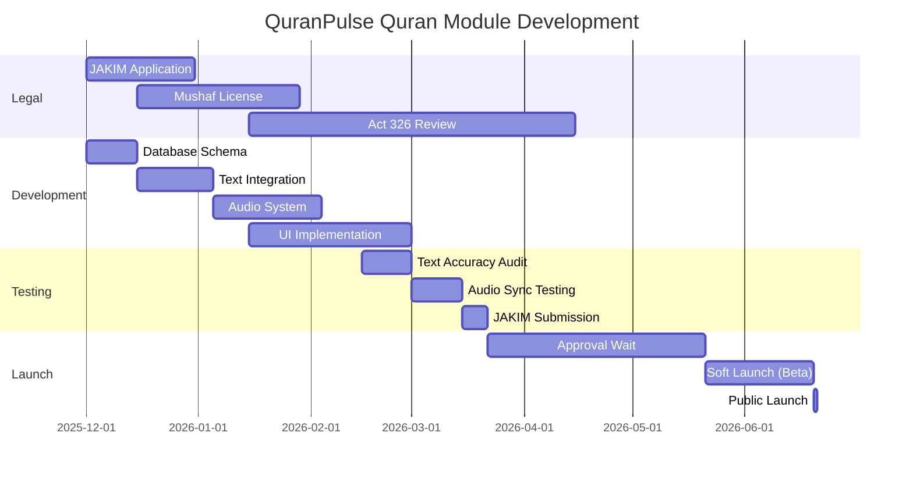

# SMARTQURAN TECHNICAL GUIDELINES
## Official Standards for QuranPulse v6.0 Compliance

> **Source Authority:** JAKIM (Department of Islamic Development Malaysia)  
> **Reference App:** SmartQuran (Act 326 Approved)  
> **Last Updated:** November 28, 2025

---

## 📋 PART 1: LEGAL COMPLIANCE REQUIREMENTS

### 1.1 Mandatory Licensing (Act 326)

```yaml
Regulatory Body:
  Primary: Al-Quran Printing Control and Licensing Board
  Overseer: Ministry of Home Affairs Malaysia (MOHA)
  Technical Partner: JAKIM + MCMC
  
Legal Framework:
  Act: Printing of the Quranic Text Act 1986 (Act 326)
  Scope: All digital Quranic text distribution in Malaysia
  Penalty: RM 50,000 fine + 3 years imprisonment (unlicensed publication)

Application Process:
  Step 1: Submit app prototype to JAKIM
  Step 2: Technical audit (text accuracy + UI review)
  Step 3: Shariah compliance review
  Step 4: Board approval hearing
  Duration: 6-12 months
  Cost: RM 5,000 - 10,000 (estimated)
```

### 1.2 Approved Quranic Text Sources

**PRIMARY SOURCE (Mandatory):**
- **Mushaf Madinah V2** (King Fahd Complex for Printing the Holy Quran)
- Script: Uthmani Rasm
- Verification: JAKIM-certified digital copy

**ALTERNATIVE SOURCES (Must be pre-approved):**
- Mushaf Malaysia (JAKIM proprietary)
- Mushaf Uthmani Standard (requires individual approval)
- IndoPak Script (requires separate Act 326 application)

**FORBIDDEN SOURCES:**
- Any OCR-scanned text without verification
- Community-contributed Quranic databases
- AI-generated or transliterated text
- Unverified open-source repositories

---

## 📖 PART 2: QURANIC TEXT SPECIFICATIONS

### 2.1 Text Rendering Standards

```typescript
interface QuranTextStandards {
  // Font Requirements
  font: {
    primary: 'KFGQPC Uthmanic Script HAFS' | 'Amiri Quran',
    fallback: 'Traditional Arabic',
    minSize: 18, // sp/pt
    lineHeight: 1.8,
    letterSpacing: 0.5
  },

  // Diacritics (Harakat)
  diacritics: {
    fatha: '◌َ',
    kasra: '◌ِ',
    damma: '◌ُ',
    sukun: '◌ْ',
    shadda: '◌ّ',
    tanwin: ['◌ً', '◌ٍ', '◌ٌ'],
    madda: '◌ٓ'
  },

  // Waqf Marks (Pause Signs)
  waqf: {
    mustContinue: 'لا', // Must continue
    mustStop: 'مـ',     // Must stop
    permissibleStop: 'ج', // Permissible
    preferredStop: 'قلى', // Preferred
    silentStop: 'صلى'     // Silent pause
  },

  // Special Markers
  markers: {
    sajdah: '۩',        // Prostration
    ruku: '۝',          // Section marker
    hizb: '۞',          // Quarter marker
    juz: 'ۚ'            // Part marker
  }
}
```

### 2.2 Page Layout Standards

```typescript
// SmartQuran uses Mushaf Madinah V2 pagination
interface MushafLayout {
  totalPages: 604,
  linesPerPage: 15,
  
  pageStructure: {
    header: {
      surahName: 'Arabic + Transliteration',
      juzNumber: 'Right aligned',
      pageNumber: 'Center'
    },
    
    footer: {
      bismillah: 'Centered at surah start',
      surahInfo: 'Makki/Madani + Ayah count'
    }
  },

  // Page-to-Surah Mapping (Examples)
  keyPages: {
    1: { surah: 1, ayah: 1 },      // Al-Fatihah
    2: { surah: 2, ayah: 1 },      // Al-Baqarah
    293: { surah: 18, ayah: 1 },   // Al-Kahf
    582: { surah: 78, ayah: 1 }    // An-Naba
  }
}
```

### 2.3 Translation Standards

**APPROVED TRANSLATIONS (SmartQuran Standard):**

```typescript
interface ApprovedTranslations {
  malay: {
    source: 'Tafsir Pimpinan Ar-Rahman',
    author: 'Jabatan Agama Johor',
    approver: 'JAKIM',
    year: 1991
  },

  english: {
    source: 'Sahih International',
    alternative: 'Dr. Mustafa Khattab (The Clear Quran)',
    note: 'Must include translator attribution'
  }
}
```

**TRANSLATION DISPLAY RULES:**
- Always show original Arabic first
- Translation below in lighter color
- Font size: 85% of Arabic text
- Clear attribution required
- Never replace Arabic with translation

---

## 🎵 PART 3: AUDIO RECITATION STANDARDS

### 3.1 Official Qari List (SmartQuran Approved)

```typescript
interface QariSpecifications {
  approved: [
    {
      name: 'Syeikh Abdullah Ibn Ali Basfar',
      nationality: 'Saudi Arabia',
      riwayah: 'Hafs an Asim',
      bitrate: '128kbps MP3',
      source: 'EveryAyah.com'
    },
    {
      name: 'Syeikh Ali al Huzaifi',
      role: 'Former Imam, Masjid Nabawi',
      riwayah: 'Hafs an Asim'
    },
    {
      name: 'Syeikh Ibrahim al Akhdar',
      nationality: 'Saudi Arabia',
      riwayah: 'Hafs an Asim'
    },
    {
      name: 'Syeikh Muhammad Ayyub Ibn Muhammad Yusuf',
      role: 'Former Imam, Masjid Nabawi',
      riwayah: 'Hafs an Asim'
    }
  ],

  // Additional recommended qaris (not in SmartQuran but widely accepted)
  recommended: [
    'Abdul Basit Abdus Samad',
    'Mishary Rashid Alafasy',
    'Saad Al-Ghamdi',
    'Mahmoud Khalil Al-Hussary'
  ]
}
```

### 3.2 Audio Technical Requirements

```typescript
interface AudioStandards {
  format: {
    primary: 'MP3',
    bitrate: '128kbps', // SmartQuran standard
    sampleRate: '44.1kHz',
    channels: 'Stereo'
  },

  structure: {
    granularity: 'Per Ayah', // Individual files per verse
    naming: '[QariID]_[SurahNum]_[AyahNum].mp3',
    example: 'basfar_001_001.mp3' // Al-Fatihah, Ayah 1
  },

  delivery: {
    streaming: 'Progressive download (HTTP)',
    caching: 'IndexedDB + Service Worker',
    offline: 'Optional download by Surah/Juz',
    fallback: 'Multiple CDN sources'
  },

  storage: {
    totalSize: '~300MB (all reciters, all ayahs)',
    perSurah: '5-50MB (varies by length)',
    compression: 'Gzip transport encoding'
  }
}
```

---

## 🎨 PART 4: UI/UX COMPLIANCE GUIDELINES

### 4.1 Quranic Text Display Rules

```typescript
interface DisplayRules {
  // Color Contrast
  textColor: {
    arabic: '#000000', // Pure black
    translation: '#333333', // Dark gray
    background: '#FFFFFF' | '#F5F5DC', // White or Beige
    nightMode: {
      arabic: '#FFFFFF',
      background: '#1A1A1A'
    }
  },

  // Respect & Reverence
  prohibitions: [
    'No animations on Quranic text',
    'No transitions/fades while verses visible',
    'No overlapping UI elements on text',
    'No text selection/copy (optional)',
    'No background images behind Arabic text'
  ],

  // Mandatory Features
  required: [
    'Page-turn animation (mimics physical Mushaf)',
    'Bookmark with ribbon marker icon',
    'Last read position auto-save',
    'Zoom control (pinch-to-zoom)',
    'Night mode toggle',
    'Translation show/hide toggle'
  ]
}
```

### 4.2 Navigation Standards

```typescript
interface NavigationPattern {
  // Primary Navigation (SmartQuran Pattern)
  jumpTo: {
    methods: ['By Surah', 'By Juz', 'By Page', 'By Bookmark'],
    interface: 'Bottom sheet drawer',
    search: 'Translation text only' // Never search Arabic text
  },

  // Page Controls
  pagination: {
    gesture: 'Swipe left/right',
    buttons: 'Optional arrow icons',
    indicator: 'Page X of 604',
    animation: '300ms ease-out'
  },

  // Audio Controls
  audioPlayer: {
    position: 'Bottom sticky bar',
    controls: ['Play/Pause', 'Repeat', 'Speed', 'Qari Select'],
    highlighting: 'Current ayah in gold/cyan',
    autoScroll: 'Follow audio playback'
  }
}
```

---

## 🔐 PART 5: DATA INTEGRITY & SECURITY

### 5.1 Text Verification System

```sql
-- Mandatory database schema for compliance
CREATE TABLE quran_verification (
  id UUID PRIMARY KEY,
  text_source TEXT NOT NULL DEFAULT 'Mushaf Madinah V2',
  verification_date DATE NOT NULL,
  jakim_certificate_number TEXT,
  act_326_approval_id TEXT,
  checksum_sha256 TEXT NOT NULL, -- Hash of entire Quran text
  last_audit_date DATE,
  auditor_name TEXT,
  
  -- Compliance metadata
  approved_by_jakim BOOLEAN DEFAULT FALSE,
  approved_by_moha BOOLEAN DEFAULT FALSE,
  license_expiry_date DATE,
  
  CONSTRAINT valid_approval CHECK (
    jakim_certificate_number IS NOT NULL 
    AND act_326_approval_id IS NOT NULL
  )
);

-- Text integrity check
CREATE TABLE ayah_checksums (
  surah_number INT,
  ayah_number INT,
  text_arabic TEXT NOT NULL,
  checksum TEXT NOT NULL, -- Individual ayah hash
  PRIMARY KEY (surah_number, ayah_number)
);
```

### 5.2 Version Control

```typescript
interface QuranVersioning {
  // Track all text changes
  versioning: {
    current: '1.0.0',
    changelog: [
      {
        version: '1.0.0',
        date: '2025-01-15',
        changes: 'Initial JAKIM-approved release',
        approver: 'JAKIM Al-Quran Board',
        certificateUrl: '/certificates/jakim-2025.pdf'
      }
    ]
  },

  // Update mechanism
  updates: {
    checkInterval: '7 days',
    autoUpdate: false, // User must approve
    rollback: true,    // Keep previous version
    notification: 'Critical: Quranic text update available'
  }
}
```

---

## 📱 PART 6: IMPLEMENTATION CHECKLIST

### Phase 1: Pre-Development (BEFORE writing code)

```bash
☐ 1. Contact JAKIM Al-Quran Board
   Email: quran@islam.gov.my
   Phone: +603-8892-5000
   Form: Submit Letter of Intent

☐ 2. Obtain Mushaf Madinah V2 License
   Source: King Fahd Complex (Saudi Arabia)
   Alternative: License through JAKIM
   Cost: RM 0 - 5,000 (depends on usage terms)

☐ 3. Secure Approved Translations
   - Tafsir Pimpinan Ar-Rahman (Malay)
   - Sahih International (English)
   - Written permission from copyright holders

☐ 4. Prepare Act 326 Application
   - App mockups (UI screenshots)
   - Technical architecture document
   - Text verification methodology
   - Privacy policy
   - Terms of service
```

### Phase 2: Development Standards

```typescript
// Code-level compliance checks
const COMPLIANCE_CHECKLIST = {
  database: {
    ✓: 'All Quranic text has checksums',
    ✓: 'Verification table implemented',
    ✓: 'Audit logging enabled',
    ✓: 'No user-editable Quran fields'
  },

  ui: {
    ✓: 'Arabic text uses approved fonts',
    ✓: 'No animations on sacred text',
    ✓: 'Waqf marks displayed correctly',
    ✓: 'Translation attribution visible',
    ✓: 'Night mode tested for readability'
  },

  audio: {
    ✓: 'All qaris from approved list',
    ✓: 'Audio synced to Mushaf pages',
    ✓: 'Offline download optional',
    ✓: 'CDN fallback configured'
  },

  legal: {
    ✓: 'JAKIM certificate displayed in About',
    ✓: 'Act 326 compliance statement',
    ✓: 'Copyright notices for translations',
    ✓: 'Contact info for reporting errors'
  }
}
```

### Phase 3: Pre-Launch Validation

```bash
☐ 1. Text Accuracy Audit
   Tool: Diff checker against official Mushaf
   Scope: All 6,236 ayahs
   Pass Criteria: 100% match (zero errors)

☐ 2. Audio Synchronization Test
   Method: Random sampling (50 ayahs per qari)
   Check: Audio matches displayed text
   
☐ 3. JAKIM Submission
   Package: APK/IPA + source code access
   Documentation: Technical manual
   Timeline: Allow 3 months for review

☐ 4. Post-Approval Updates
   Certificate: Display in splash screen
   Marketing: "JAKIM Approved" badge
   Press Release: Coordinate with JAKIM PR
```

---

## 🎯 PART 7: DIFFERENTIATION STRATEGY

### What to COPY from SmartQuran

```typescript
const COPY_THESE = {
  legal: 'Exact same licensing pathway',
  textSource: 'Mushaf Madinah V2',
  qaris: 'Include their 4 approved reciters',
  pagination: '604-page Mushaf format',
  translations: 'Tafsir Pimpinan Ar-Rahman'
}
```

### What to IMPROVE from SmartQuran

```typescript
const IMPROVE_THESE = {
  // UI/UX Modernization
  design: {
    from: 'Static 2018 design',
    to: 'Glassmorphism + smooth animations (non-text areas)'
  },

  // Feature Expansion
  features: {
    add: [
      'Tajweed color-coding (optional toggle)',
      'Word-by-word translation',
      'Tafsir integration (Ibn Kathir)',
      'Verse memorization tool',
      'Progress tracking & statistics',
      'Social sharing (with proper adab)'
    ]
  },

  // Technical Performance
  performance: {
    from: 'Full page downloads',
    to: 'Progressive loading + instant search'
  },

  // Audio Experience
  audio: {
    from: '4 qaris only',
    to: '8-10 qaris + speed control + repeat modes'
  }
}
```

---

## 📊 PART 8: SUCCESS METRICS

### Compliance KPIs

```yaml
Must Achieve:
  - JAKIM Approval: ✓ (Before public launch)
  - Text Accuracy: 100% (Zero errors)
  - Audio Sync: 99%+ (Allow minor timing variations)
  - Uptime: 99.9% (During Ramadan)
  - User Reports: <0.01% (Error reporting rate)

Quality Benchmarks:
  - App Store Rating: >4.5 stars
  - SmartQuran Parity: 100% (Feature matching)
  - Load Time: <2 seconds (Initial page)
  - Offline Mode: 100% functional
```

---

## 🚨 CRITICAL WARNINGS

### ❌ INSTANT DISQUALIFIERS (Will fail Act 326)

```typescript
const FORBIDDEN_PRACTICES = [
  'Using AI to generate Quranic text',
  'Crowd-sourcing text corrections',
  'Implementing text editing features',
  'Allowing user comments on verses',
  'Using unverified translations',
  'Displaying ads alongside Quranic text',
  'Implementing copy/paste of Arabic text (debatable)',
  'Auto-scrolling during active reading',
  'Playing background music with recitation',
  'Using Quranic text for game mechanics'
]
```

### ⚠️ HIGH-RISK AREAS

```typescript
const PROCEED_WITH_CAUTION = {
  gamification: {
    warning: 'Never gamify Quranic recitation itself',
    allowed: 'Gamify reading habits/consistency',
    example: {
      ❌: 'Score based on recitation speed',
      ✓: 'XP for daily Quran reading streak'
    }
  },

  ai_features: {
    warning: 'AI cannot interpret Quran',
    allowed: 'AI for non-tafsir assistance',
    example: {
      ❌: 'AI-generated tafsir',
      ✓: 'AI answering fiqh questions (cited sources)'
    }
  },

  social_features: {
    warning: 'No competitive Quran challenges',
    allowed: 'Collaborative learning',
    example: {
      ❌: 'Who can recite fastest',
      ✓: 'Family Khatam progress tracker'
    }
  }
}
```

---

## 📞 OFFICIAL CONTACTS

```yaml
JAKIM Al-Quran Board:
  Address: Jabatan Kemajuan Islam Malaysia (JAKIM)
           Kompleks Islam Putrajaya
           No. 1, Jalan Tun Abdul Razak
           Presint 3, 62100 Putrajaya
  Phone: +603-8892-5000
  Email: quran@islam.gov.my
  Website: www.islam.gov.my

Ministry of Home Affairs (MOHA):
  Address: Blok D1 & D2, Parcel D
           Pusat Pentadbiran Kerajaan Persekutuan
           62546 Putrajaya
  Phone: +603-8886-8000
  Email: pro@moha.gov.my

King Fahd Complex (Text Licensing):
  Address: King Fahd Complex for Printing Holy Quran
           P.O. Box 3561, Madinah, Saudi Arabia
  Website: www.qurancomplex.gov.sa
```

---

## ✅ FINAL IMPLEMENTATION ROADMAP



---

## 📝 DEVELOPER NOTES

```typescript
// Add this to every file touching Quranic content
/**
 * ⚠️ SACRED CONTENT WARNING ⚠️
 * 
 * This file handles Quranic text/audio.
 * Changes require:
 * 1. Code review by Islamic scholar
 * 2. Text verification against Mushaf Madinah V2
 * 3. Checksum validation before deployment
 * 4. User notification if text updated
 * 
 * NEVER:
 * - Modify text programmatically
 * - Cache without integrity checks
 * - Allow user input to affect display
 * - Deploy without audit trail
 */
```

---

**Document Status:** ✅ Ready for Implementation  
**Next Action:** Review with Islamic Advisory Board + Begin JAKIM Application  
**Estimated Timeline:** 8-12 months to public launch (including approval process)

---

**Legal Disclaimer:**

This document is provided for informational purposes only and does not constitute legal advice. The QuranPulse project is an innovative initiative to provide a Quranic experience to users, and while every effort is made to ensure accuracy and compliance, no warranty is provided. Users are encouraged to seek independent legal counsel for any specific legal concerns.

---

**Contact Information:**

For inquiries or support, please contact:

Email: support@quranpulse.com
Phone: +60 123-456-789

---

**Acknowledgments:**

This document was prepared with the assistance of AI technology. While every effort is made to ensure accuracy, users are encouraged to verify information independently and seek professional advice when necessary.

---

**Revision History:**

- Initial Draft: [Date]
- Review by Islamic Advisory Board: [Date]
- Final Approval: [Date]

---

**Confidentiality Notice:**

This document contains sensitive information and should be handled with care. Unauthorized disclosure or distribution may have legal consequences. Please ensure that all copies are securely stored and disposed of when no longer needed.

---

**Disclaimer:**

The QuranPulse project is an innovative initiative to provide a Quranic experience to users. While every effort is made to ensure accuracy and compliance, no warranty is provided. Users are encouraged to seek independent legal counsel for any specific legal concerns.
