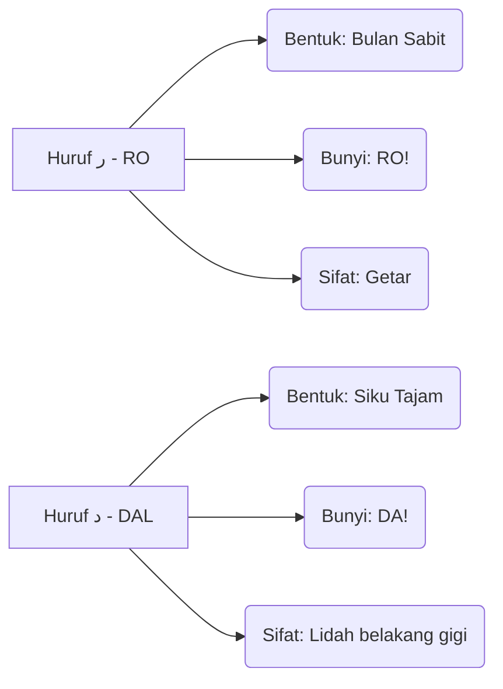

# Panduan Bimbingan Iqra 1 - Muka Surat 9
## Pengenalan Huruf Ra'

---

### Diagram Aliran Bacaan (Kanan ke Kiri)
Dalam setiap kotak, anda perlu mula membaca dari arah anak panah ini:
```
[ 3 ] <--- [ 2 ] <--- [ 1 ]
```

### Diagram Struktur Kotak (Baris demi Baris)

| Baris | Kotak Kanan (Mula Sini) | Kotak Kiri (Seterusnya) | Fokus Latihan |
| :--- | :--- | :--- | :--- |
| TAJUK | رَ - دَ | ذَ - رَ | Perbezaan bentuk RO & DAL. |
| Baris 2 | خَ - ذَ - رَ | رَ - حَ - دَ | Latihan tukar bunyi secara berselang-seli. |
| Baris 3 | جَ - رَ - ذَ | بَ - رَ - دَ | Latihan tukar bunyi secara berselang-seli. |
| Baris 4 | رَ - حَ - ثَ | تَ - ذَ - رَ | Latihan tukar bunyi secara berselang-seli. |
| Baris 5 | خَ - رَ - جَ | حَ - ذَ - رَ | Latihan tukar bunyi secara berselang-seli. |
| Baris 6 | بَ - رَ - تَ | خَ - خَ - ذَ | Latihan tukar bunyi secara berselang-seli. |
| Baris 7 | حَ - جَ | رَ | Latihan tukar bunyi secara berselang-seli. |
| Baris 8 | أَ - بَ - تَ - ثَ - جَ | حَ - خَ - دَ - ذَ - رَ | Ujian Akhir: Kelancaran sebelum pindah MS. |


### Diagram Perbandingan Karakter (Identiti Huruf)


### Diagram "Checklist" Kelancaran
Untuk menganggap diri anda sudah "paham" dan "lulus" muka surat ini, anda perlu pastikan:

- [ ] **Arah Benar:** Mata bergerak dari kanan ke kiri tanpa tertukar.
- [ ] **Bunyi Pendek:** Tidak membaca Aaaaa (2 harakat), tapi RO! (1 harakat).
- [ ] **Kenal Titik:** Pantas bezakan RO (Bulan Sabit) dengan DAL (Siku Tajam).
- [ ] **Kelajuan Tetap:** Boleh baca Baris Akhir tanpa berhenti atau berfikir lama.

### Ringkasan Untuk Anda
Bayangkan imej ini sebagai satu set latihan "Gym" untuk mata. Baris atas adalah *warm-up*, dan baris paling bawah adalah *heavy lifting*. Jika anda sudah boleh sebut baris terakhir **"أَ بَ تَ ثَ جَ حَ خَ دَ ذَ رَ"** dengan sekali nafas dan kelajuan yang stabil, bermakna saraf otak anda sudah berjaya menterjemah kod visual Arab tersebut dengan sempurna!

---
*Generated by QuranPulse AI Engine*
