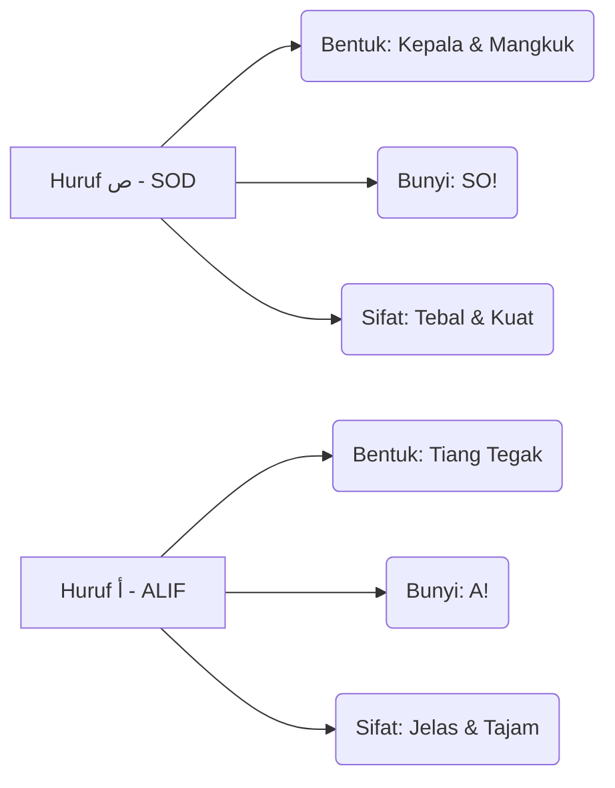

# Panduan Bimbingan Iqra 1 - Muka Surat 13
## Pengenalan Huruf Sod

---

### Diagram Aliran Bacaan (Kanan ke Kiri)
Dalam setiap kotak, anda perlu mula membaca dari arah anak panah ini:
```
[ 3 ] <--- [ 2 ] <--- [ 1 ]
```

### Diagram Struktur Kotak (Baris demi Baris)

| Baris | Kotak Kanan (Mula Sini) | Kotak Kiri (Seterusnya) | Fokus Latihan |
| :--- | :--- | :--- | :--- |
| TAJUK | صَ - صَ | أَ - شَ | Perbezaan bentuk SOD & ALIF. |
| Baris 2 | صَ - شَ - زَ | سَ - رَ - صَ | Latihan tukar bunyi secara berselang-seli. |
| Baris 3 | صَ - ثَ - ذَ | دَ - سَ - صَ | Latihan tukar bunyi secara berselang-seli. |
| Baris 4 | شَ - رَ - تَ | سَ - خَ - صَ | Latihan tukar bunyi secara berselang-seli. |
| Baris 5 | حَ - صَ - دَ | ذَ - زَ - صَ | Latihan tukar bunyi secara berselang-seli. |
| Baris 6 | حَ - ذَ - رَ | شَ - رَ - بَ | Latihan tukar bunyi secara berselang-seli. |
| Baris 7 | صَ - سَ | جَ - زَ | Latihan tukar bunyi secara berselang-seli. |
| Baris 8 | صَ - دَ - خَ | صَ - جَ - ذَ | Latihan tukar bunyi secara berselang-seli. |
| Baris 9 | شَ - رَ - زَ | شَ - خَ - صَ | Latihan tukar bunyi secara berselang-seli. |
| Baris 10 | أَ - بَ - تَ | ثَ - جَ - حَ | Latihan tukar bunyi secara berselang-seli. |
| Baris 11 | خَ - دَ - ذَ - رَ | زَ - سَ - شَ - صَ | Ujian Akhir: Kelancaran sebelum pindah MS. |


### Diagram Perbandingan Karakter (Identiti Huruf)


### Diagram "Checklist" Kelancaran
Untuk menganggap diri anda sudah "paham" dan "lulus" muka surat ini, anda perlu pastikan:

- [ ] **Arah Benar:** Mata bergerak dari kanan ke kiri tanpa tertukar.
- [ ] **Bunyi Pendek:** Tidak membaca Aaaaa (2 harakat), tapi SO! (1 harakat).
- [ ] **Kenal Titik:** Pantas bezakan SOD (Kepala & Mangkuk) dengan ALIF (Tiang Tegak).
- [ ] **Kelajuan Tetap:** Boleh baca Baris Akhir tanpa berhenti atau berfikir lama.

### Ringkasan Untuk Anda
Bayangkan imej ini sebagai satu set latihan "Gym" untuk mata. Baris atas adalah *warm-up*, dan baris paling bawah adalah *heavy lifting*. Jika anda sudah boleh sebut baris terakhir **"خَ دَ ذَ رَ   زَ سَ شَ صَ"** dengan sekali nafas dan kelajuan yang stabil, bermakna saraf otak anda sudah berjaya menterjemah kod visual Arab tersebut dengan sempurna!

---
*Generated by QuranPulse AI Engine*
