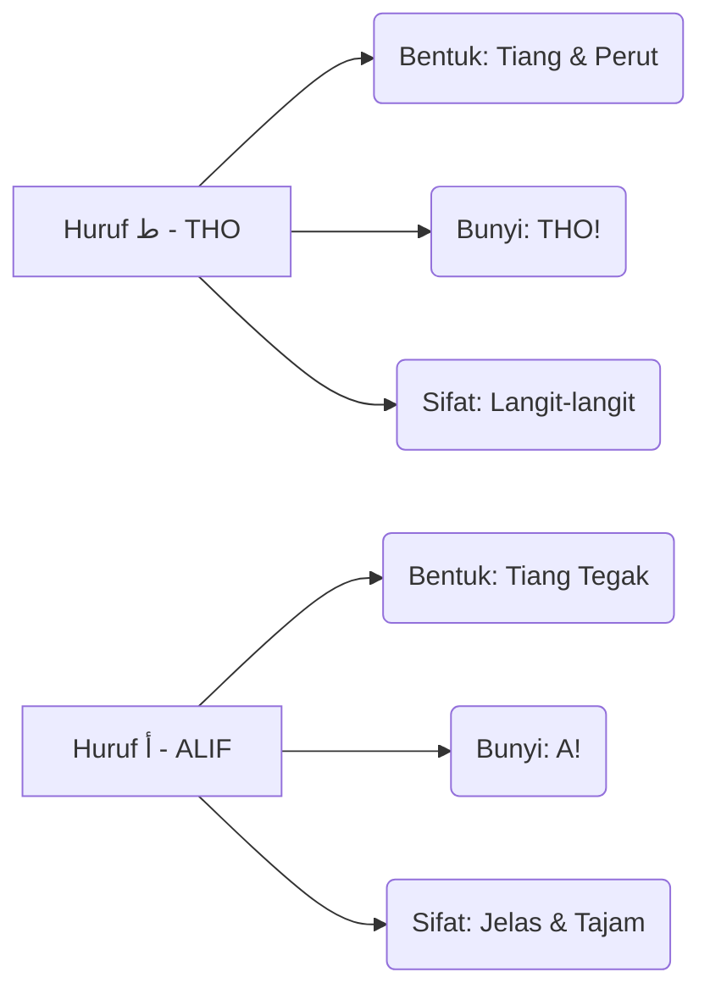

# Panduan Bimbingan Iqra 1 - Muka Surat 15
## Pengenalan Huruf Tho'

---

### Diagram Aliran Bacaan (Kanan ke Kiri)
Dalam setiap kotak, anda perlu mula membaca dari arah anak panah ini:
```
[ 3 ] <--- [ 2 ] <--- [ 1 ]
```

### Diagram Struktur Kotak (Baris demi Baris)

| Baris | Kotak Kanan (Mula Sini) | Kotak Kiri (Seterusnya) | Fokus Latihan |
| :--- | :--- | :--- | :--- |
| TAJUK | طَ - طَ | أَ - ضَ | Perbezaan bentuk THO & ALIF. |
| Baris 2 | زَ - طَ - شَ | حَ - جَ - طَ | Latihan tukar bunyi secara berselang-seli. |
| Baris 3 | تَ - صَ - ضَ | ذَ - طَ - سَ | Latihan tukar bunyi secara berselang-seli. |
| Baris 4 | زَ - دَ - طَ | دَ - ضَ - صَ | Latihan tukar bunyi secara berselang-seli. |
| Baris 5 | سَ - رَ - طَ | شَ - ضَ - تَ | Latihan tukar bunyi secara berselang-seli. |
| Baris 6 | شَ - خَ - طَ | طَ - حَ - ذَ | Latihan tukar bunyi secara berselang-seli. |
| Baris 7 | بَ - صَ - ضَ | ذَ - رَ - طَ | Latihan tukar bunyi secara berselang-seli. |
| Baris 8 | جَ - زَ - ضَ | ثَ - أَ - شَ | Latihan tukar bunyi secara berselang-seli. |
| Baris 9 | سَ - خَ | طَ | Latihan tukar bunyi secara berselang-seli. |
| Baris 10 | أَ - بَ - تَ - ثَ | جَ - حَ - خَ | Latihan tukar bunyi secara berselang-seli. |
| Baris 11 | دَ - ذَ - رَ - زَ - سَ | شَ - صَ - ضَ - طَ | Ujian Akhir: Kelancaran sebelum pindah MS. |


### Diagram Perbandingan Karakter (Identiti Huruf)


### Diagram "Checklist" Kelancaran
Untuk menganggap diri anda sudah "paham" dan "lulus" muka surat ini, anda perlu pastikan:

- [ ] **Arah Benar:** Mata bergerak dari kanan ke kiri tanpa tertukar.
- [ ] **Bunyi Pendek:** Tidak membaca Aaaaa (2 harakat), tapi THO! (1 harakat).
- [ ] **Kenal Titik:** Pantas bezakan THO (Tiang & Perut) dengan ALIF (Tiang Tegak).
- [ ] **Kelajuan Tetap:** Boleh baca Baris Akhir tanpa berhenti atau berfikir lama.

### Ringkasan Untuk Anda
Bayangkan imej ini sebagai satu set latihan "Gym" untuk mata. Baris atas adalah *warm-up*, dan baris paling bawah adalah *heavy lifting*. Jika anda sudah boleh sebut baris terakhir **"دَ ذَ رَ زَ سَ شَ صَ ضَ طَ"** dengan sekali nafas dan kelajuan yang stabil, bermakna saraf otak anda sudah berjaya menterjemah kod visual Arab tersebut dengan sempurna!

---
*Generated by QuranPulse AI Engine*
