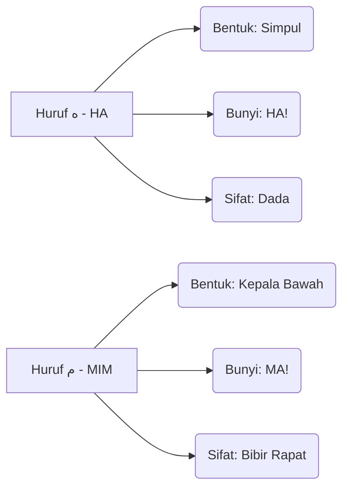

# Panduan Bimbingan Iqra 1 - Muka Surat 26
## Pengenalan Huruf Ha

---

### Diagram Aliran Bacaan (Kanan ke Kiri)
Dalam setiap kotak, anda perlu mula membaca dari arah anak panah ini:
```
[ 3 ] <--- [ 2 ] <--- [ 1 ]
```

### Diagram Struktur Kotak (Baris demi Baris)

| Baris | Kotak Kanan (Mula Sini) | Kotak Kiri (Seterusnya) | Fokus Latihan |
| :--- | :--- | :--- | :--- |
| TAJUK | هَ - هَ | مَ - شَ | Perbezaan bentuk HA & MIM. |
| Baris 2 | جَ - هَ - دَ | دَ - وَ - هَ | Latihan tukar bunyi secara berselang-seli. |
| Baris 3 | فَ - خَ - عَ | طَ - هَ - رَ | Latihan tukar bunyi secara berselang-seli. |
| Baris 4 | وَ - ضَ - حَ | وَ - هَ - ظَ | Latihan tukar bunyi secara berselang-seli. |
| Baris 5 | لَ - مَ - نَ | زَ - هَ - قَ | Latihan tukar bunyi secara berselang-seli. |
| Baris 6 | سَ - هَ - لَ | ذَ - غَ - صَ | Latihan tukar bunyi secara berselang-seli. |
| Baris 7 | جَ - هَ | هَ | Latihan tukar bunyi secara berselang-seli. |
| Baris 8 | أَ - بَ - تَ - ثَ - جَ | حَ - خَ - دَ - ذَ | Latihan tukar bunyi secara berselang-seli. |
| Baris 9 | رَ - زَ - سَ - شَ | صَ - ضَ - طَ - ظَ | Latihan tukar bunyi secara berselang-seli. |
| Baris 10 | عَ - غَ - فَ - قَ - كَ | لَ - مَ - نَ - وَ - هَ | Ujian Akhir: Kelancaran sebelum pindah MS. |


### Diagram Perbandingan Karakter (Identiti Huruf)


### Diagram "Checklist" Kelancaran
Untuk menganggap diri anda sudah "paham" dan "lulus" muka surat ini, anda perlu pastikan:

- [ ] **Arah Benar:** Mata bergerak dari kanan ke kiri tanpa tertukar.
- [ ] **Bunyi Pendek:** Tidak membaca Aaaaa (2 harakat), tapi HA! (1 harakat).
- [ ] **Kenal Titik:** Pantas bezakan HA (Simpul) dengan MIM (Kepala Bawah).
- [ ] **Kelajuan Tetap:** Boleh baca Baris Akhir tanpa berhenti atau berfikir lama.

### Ringkasan Untuk Anda
Bayangkan imej ini sebagai satu set latihan "Gym" untuk mata. Baris atas adalah *warm-up*, dan baris paling bawah adalah *heavy lifting*. Jika anda sudah boleh sebut baris terakhir **"عَ غَ فَ قَ كَ لَ مَ نَ وَ هَ"** dengan sekali nafas dan kelajuan yang stabil, bermakna saraf otak anda sudah berjaya menterjemah kod visual Arab tersebut dengan sempurna!

---
*Generated by QuranPulse AI Engine*
