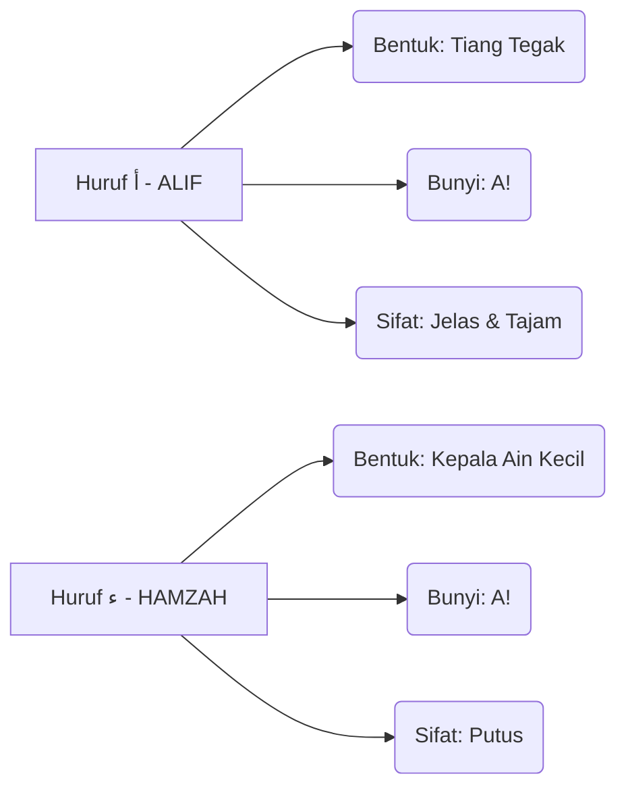

# Panduan Bimbingan Iqra 1 - Muka Surat 28
## Pengenalan Hamzah & Latihan

---

### Diagram Aliran Bacaan (Kanan ke Kiri)
Dalam setiap kotak, anda perlu mula membaca dari arah anak panah ini:
```
[ 3 ] <--- [ 2 ] <--- [ 1 ]
```

### Diagram Struktur Kotak (Baris demi Baris)

| Baris | Kotak Kanan (Mula Sini) | Kotak Kiri (Seterusnya) | Fokus Latihan |
| :--- | :--- | :--- | :--- |
| TAJUK | أَ - = - ءَ | رَ - = - رَ | Perbezaan bentuk ALIF & HAMZAH. |
| Baris 2 | مَ - = - مَ | هَ - = - هَ | Latihan tukar bunyi secara berselang-seli. |
| Baris 3 | بَ - رَ - أَ | بَ - رَ - رَ | Latihan tukar bunyi secara berselang-seli. |
| Baris 4 | قَ - رَ - أَ | أَ - مَ - مَ | Latihan tukar bunyi secara berselang-seli. |
| Baris 5 | جَ - نَ - أَ | سَ - ءَ - لَ | Latihan tukar bunyi secara berselang-seli. |
| Baris 6 | رَ - زَ - قَ | مَ - دَ - حَ | Latihan tukar bunyi secara berselang-seli. |
| Baris 7 | غَ - مَ - مَ | لَ - ءَ - كَ | Latihan tukar bunyi secara berselang-seli. |
| Baris 8 | مَ - شَ - ءَ | مَ - دَ - مَ | Latihan tukar bunyi secara berselang-seli. |
| Baris 9 | سَ - يَ - رَ | جَ - زَ - مَ | Latihan tukar bunyi secara berselang-seli. |
| Baris 10 | لَ - بَ - دَ | مَ - قَ - تَ | Latihan tukar bunyi secara berselang-seli. |
| Baris 11 | كَ - لَ - مَ | حَ - سَ - نَ | Ujian Akhir: Kelancaran sebelum pindah MS. |


### Diagram Perbandingan Karakter (Identiti Huruf)


### Diagram "Checklist" Kelancaran
Untuk menganggap diri anda sudah "paham" dan "lulus" muka surat ini, anda perlu pastikan:

- [ ] **Arah Benar:** Mata bergerak dari kanan ke kiri tanpa tertukar.
- [ ] **Bunyi Pendek:** Tidak membaca Aaaaa (2 harakat), tapi A! (1 harakat).
- [ ] **Kenal Titik:** Pantas bezakan ALIF (Tiang Tegak) dengan HAMZAH (Kepala Ain Kecil).
- [ ] **Kelajuan Tetap:** Boleh baca Baris Akhir tanpa berhenti atau berfikir lama.

### Ringkasan Untuk Anda
Bayangkan imej ini sebagai satu set latihan "Gym" untuk mata. Baris atas adalah *warm-up*, dan baris paling bawah adalah *heavy lifting*. Jika anda sudah boleh sebut baris terakhir **"كَ لَ مَ   حَ سَ نَ"** dengan sekali nafas dan kelajuan yang stabil, bermakna saraf otak anda sudah berjaya menterjemah kod visual Arab tersebut dengan sempurna!

---
*Generated by QuranPulse AI Engine*
