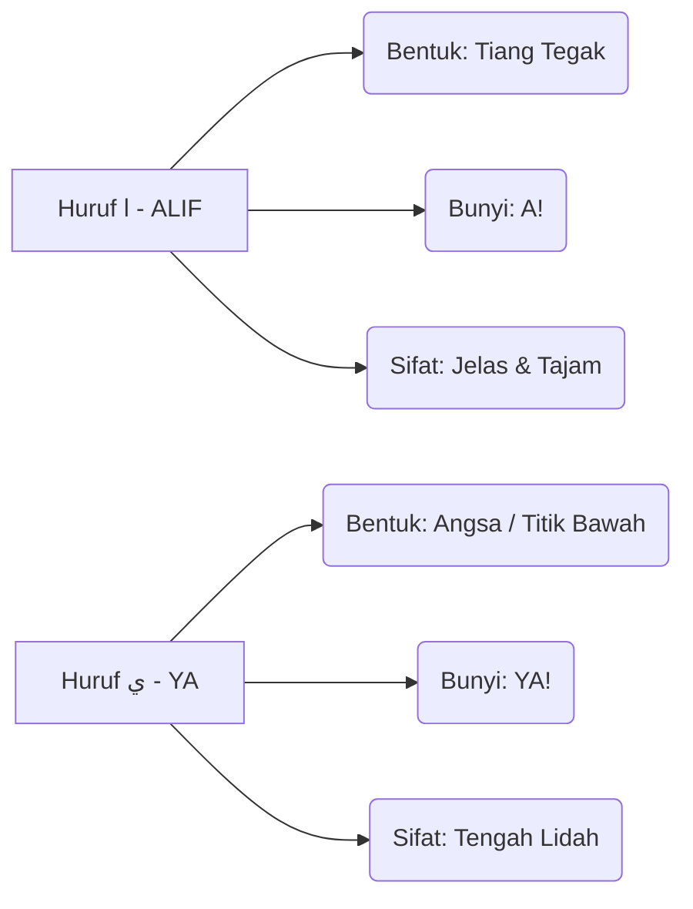

# Panduan Bimbingan Iqra 6 - Muka Surat 2
## Surah Al-Fatihah (Ayat 5-7)

---

### Diagram Aliran Bacaan (Kanan ke Kiri)
Dalam setiap kotak, anda perlu mula membaca dari arah anak panah ini:
```
[ 3 ] <--- [ 2 ] <--- [ 1 ]
```

### Diagram Struktur Kotak (Baris demi Baris)

| Baris | Kotak Kanan (Mula Sini) | Kotak Kiri (Seterusnya) | Fokus Latihan |
| :--- | :--- | :--- | :--- |
| TAJUK | اِيَّاكَ - نَعْبُدُ | وَاِيَّاكَ - نَسْتَعِينُ | Perbezaan bentuk ALIF & YA. |
| Baris 2 | اِهْدِنَا - الصِّرَاطَ | الْمُسْتَقِيمَ | Latihan tukar bunyi secara berselang-seli. |
| Baris 3 | صِرَاطَ - الَّذِينَ | اَنْعَمْتَ - عَلَيْهِمْ | Latihan tukar bunyi secara berselang-seli. |
| Baris 4 | غَيْرِ - الْمَغْضُوبِ - عَلَيْهِمْ | وَلَا - الضَّالِّينَ | Ujian Akhir: Kelancaran sebelum pindah MS. |


### Diagram Perbandingan Karakter (Identiti Huruf)


### Diagram "Checklist" Kelancaran
Untuk menganggap diri anda sudah "paham" dan "lulus" muka surat ini, anda perlu pastikan:

- [ ] **Arah Benar:** Mata bergerak dari kanan ke kiri tanpa tertukar.
- [ ] **Bunyi Pendek:** Tidak membaca Aaaaa (2 harakat), tapi A! (1 harakat).
- [ ] **Kenal Titik:** Pantas bezakan ALIF (Tiang Tegak) dengan YA (Angsa / Titik Bawah).
- [ ] **Kelajuan Tetap:** Boleh baca Baris Akhir tanpa berhenti atau berfikir lama.

### Ringkasan Untuk Anda
Bayangkan imej ini sebagai satu set latihan "Gym" untuk mata. Baris atas adalah *warm-up*, dan baris paling bawah adalah *heavy lifting*. Jika anda sudah boleh sebut baris terakhir **"غَيْرِ الْمَغْضُوبِ عَلَيْهِمْ   وَلَا الضَّالِّينَ"** dengan sekali nafas dan kelajuan yang stabil, bermakna saraf otak anda sudah berjaya menterjemah kod visual Arab tersebut dengan sempurna!

---
*Generated by QuranPulse AI Engine*
